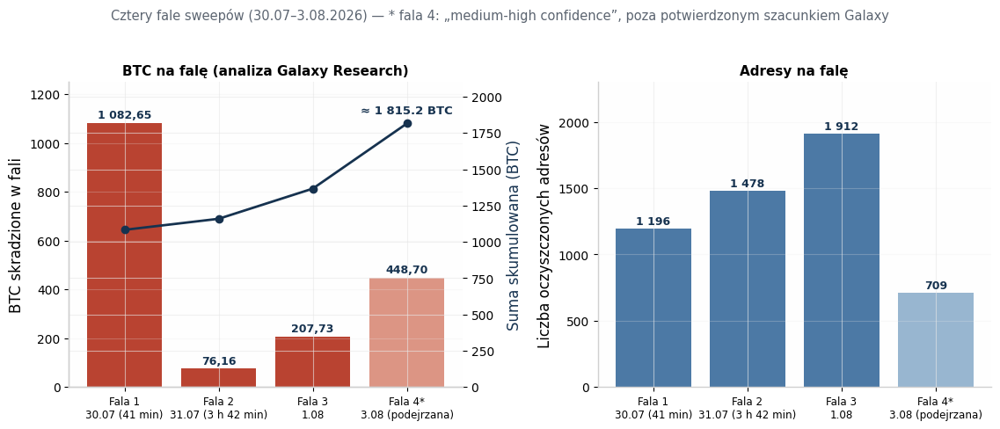
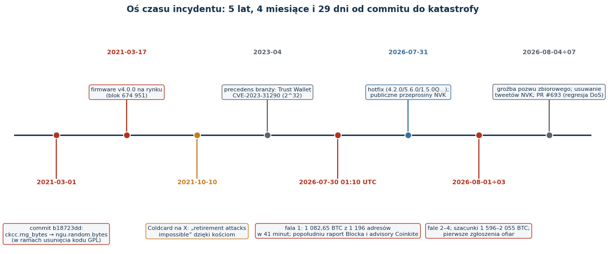
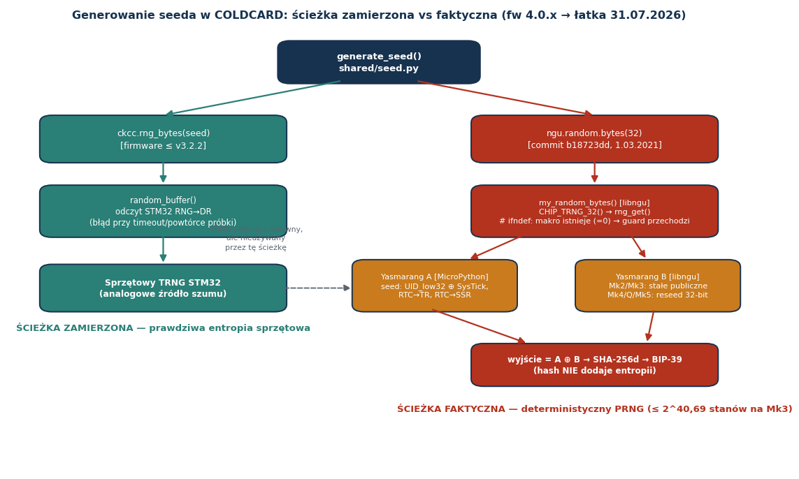
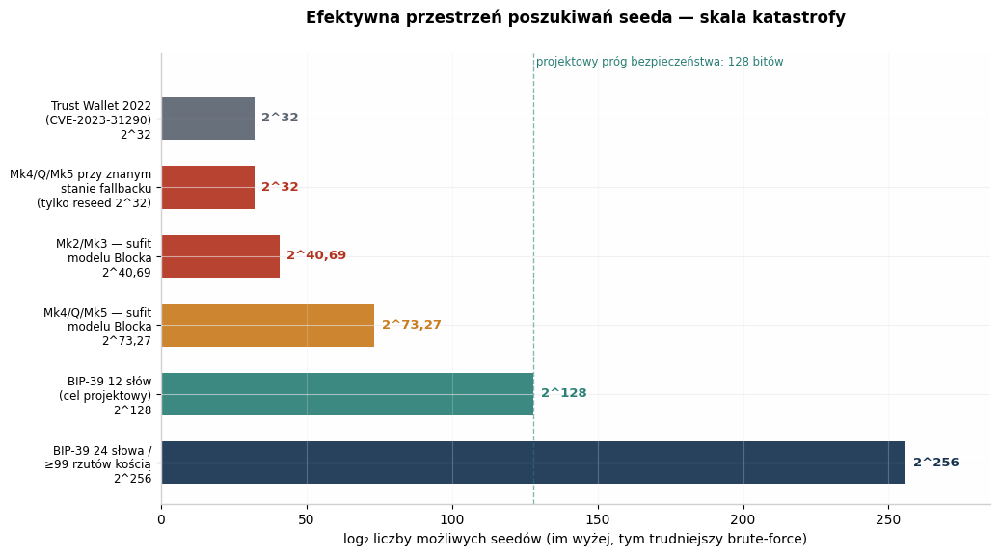
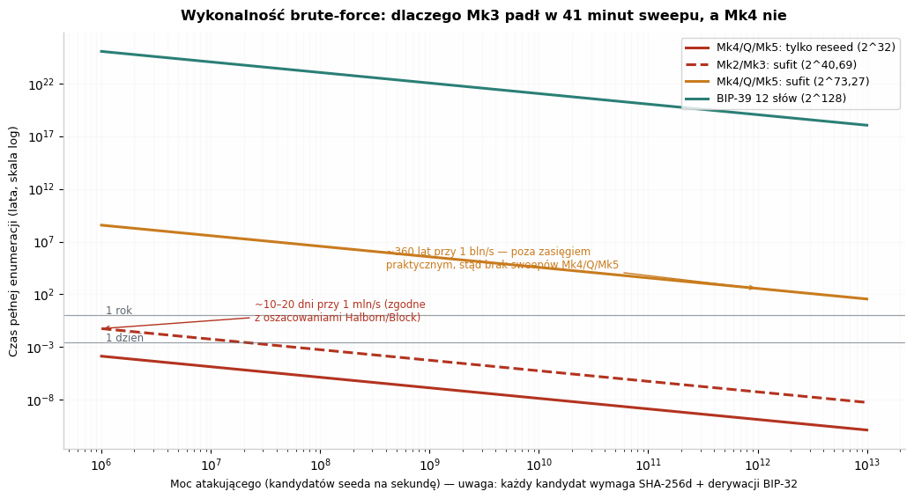

# Hack na entropię Coldcard (lipiec–sierpień 2026): inżynieryjna analiza krytyczna incydentu, technologii seed i granic modelu self-custody BTC

**Typ dokumentu:** raport badawczy na poziomie inżynierskim (deep research) — analiza przyczyn źródłowych, rekonstrukcja matematyczna przestrzeni poszukiwań, kontekst branżowy, rekomendacje obronne.
**Stan na:** 10 sierpnia 2026 r. (aktualizacja — patrz rozdział 10)

---

## 1. Streszczenie wykonawcze

W czwartek **30 lipca 2026 r.**, w oknie **41 minut (01:10:20–01:51:26 UTC)**, nieznany aktor opróżnił **1 196 adresów Bitcoin**, zabierając **1 082,65 BTC (ok. 70,2 mln USD)** — bez fizycznego dostępu do jakiegokolwiek urządzenia, bez złamania PIN-u, bez ataku na protokół Bitcoina [^43^][^6^]. W kolejnych dniach nastąpiły co najmniej trzy dalsze fale; potwierdzone szacunki Galaxy Research mówią o **1 596 BTC z ok. 7 300 adresów**, a scenariusz z czwartą falą podnosi łączną stratę do **2 055 BTC (~130 mln USD)** [^56^][^54^]. Był to największy znany exploit portfela sprzętowego w historii i trzeci co do wielkości hack kryptowalutowy 2026 roku [^15^].

Przyczyna źródłowa nie była spektakularna w sensie kryptograficznym — była trywialna w sensie inżynieryjnym i dlatego tak przerażająca. **1 marca 2021 r.**, w commicie `b18723dd`, Coinkite zmigrowało generowanie seeda z własnej funkcji `ckcc.rng_bytes()` (sięgającej sprzętowego generatora TRNG mikrokontrolera STM32) do `ngu.random.bytes()` z biblioteki libngu [^18^]. Przez błąd w strażniku preprocesora — `#ifndef` sprawdzające **istnienie** makra `MICROPY_HW_ENABLE_RNG` zamiast jego **wartości** — symbol `rng_get()` rozwiązał się w konsolidatorze do programowego generatora **Yasmarang**, inicjalizowanego z identyfikatora układu i rejestrów zegara [^18^][^13^]. Efekt: przez **5 lat, 4 miesiące i 29 dni** portfele generowały mnemoniki wyglądające na losowe, lecz o efektywnej przestrzeni poszukiwań **≤ 2^40,69 na Mk2/Mk3** i **≤ 2^73,27 na Mk4/Mk5/Q**, zamiast projektowych 2^128 [^13^][^7^].

Raport odpowiada na sześć pytań: **co się stało** (rekonstrukcja fal i skali), **dlaczego** (analiza inżynieryjna, organizacyjna i kulturowa), **jak działa technologia seed** (formalne podstawy BIP-39/BIP-32, TRNG vs PRNG), **co robił i mówił właściciel** (komunikacja kryzysowa Rodolfo Novaka i historia jego ataków na konkurencję), **jakie były precedensy** (Trust Wallet, Dark Skippy, Kraken vs Trezor, Ledger Recover) oraz **jak się zabezpieczyć** (migracja, kości, passphrase, multisig, higiena inżynieryjna). Kluczowa teza: bezpieczeństwo portfela sprzętowego rozstrzyga się **w milisekundzie generowania seeda**, a wszystkie późniejsze warstwy — air-gap, secure elementy, stalowe backupy — są wtórne wobec jakości entropii [^1^].

---

## 2. Skala i przebieg ataku: cztery fale i anatomia sweepu

### 2.1. Rekonstrukcja on-chain

Atak nie miał postaci pojedynczej transakcji exploitującej — nie istniał „smart contract z dziurą”, nie było włamania do infrastruktury Coinkite. Napastnik przez tygodnie lub miesiące **rekonstruował offline kandydatów na seedy**, derywował z nich adresy i porównywał je z publicznym rejestrem UTXO, a następnie wykonał skoordynowane „wymiecenie” (sweep) skompromitowanych portfeli zwykłymi, poprawnymi transakcjami [^13^][^4^]. Galaxy Research zrekonstruowało falę pierwszą: 1 196 adresów opróżnionych w całość, bez outputów reszty, ze **stałą, zaszytą na sztywno opłatą 30 sat/vB**, w sześciu blokach [^43^][^26^]. Fala druga (27 godzin później, 76,16 BTC z 1 478 adresów przez 3 h 42 min) używała głównie 10 i 50 sat/vB; odciski transakcyjne dwóch pierwszych fal wskazują na jednego operatora lub jedno narzędzie, trzecia łamie wzorzec [^43^][^42^].

Dowód „genetyczny” potwierdził związek z błędem: wszystkie **3 953 skradzione monety** z dwóch pierwszych fal zostały wykute (utworzone) **po bloku 674 951** — czyli po 17 marca 2021 r., dniu wydania podatnego firmware v4.0.0; najstarsza moneta fali pierwszej pochodzi z bloku 675 955, fali drugiej z 675 829 [^43^]. To sygnatura czasowa dokładnie zgodna z oknem podatności: atakujący rekonstruował wyłącznie seedy wygenerowane przez wadliwy firmware.

| Fala | Data/czas (UTC) | Adresy | BTC | Charakterystyka |
|---|---|---|---|---|
| 1 | 30.07.2026, 01:10–01:51 (41 min) | 1 196 (później skorygowano do 1 195) | 1 082,65 | stała opłata 30 sat/vB, brak reszt, 6 bloków [^43^][^5^] |
| 2 | 31.07.2026 rano (3 h 42 min) | 1 478 | 76,16 | głównie 10/50 sat/vB, zbiór ofiar rozłączny z falą 1 [^43^] |
| 3 | 1.08.2026 | 1 912 | 207,73 | inny odcisk transakcyjny — inny aktor lub zmiana taktyki [^42^][^4^] |
| 4 (podejrzana) | 3.08.2026 | ~709 | ~448,7 | „medium-high confidence”, wyłączona z potwierdzonego szacunku Galaxy do czasu potwierdzeń ofiar [^56^][^5^] |



### 2.2. Rozbieżności szacunków i dlaczego są nieuniknione

Bitcoin identyfikuje adresy, nie ludzi ani modele urządzeń — przypisanie sweepu do błędu Coldcard opiera się na heurystykach (pełne opróżnienie bez reszty, podobne typy inputów, ciasne okna czasowe, powtarzalne opłaty, wspólne miejsca docelowe, późniejsze współwydawanie) oraz na zgłoszeniach ofiar, a nie na kryptograficznej reprodukcji każdego seeda [^13^]. Dlatego liczby różnią się między trackerami i należy je prezentować jako przedziały z metodologią, nie jako pojedynczą „prawdę”.

| Źródło / tracker | Stan na | Szacunek | Metoda |
|---|---|---|---|
| Galaxy Research (potwierdzone) | 3–4.08.2026 | **1 596 BTC** z ~7 300 adresów (3 fale + 14 mniejszych incydentów; 73 zgłoszenia ofiar) | on-chain + kanał prywatny z ofiarami [^56^] |
| Galaxy Research (z falą 4) | 4.08.2026 | do **2 055 BTC** (~130 mln USD) | jak wyżej, fala 4 „medium-high confidence” [^56^][^54^] |
| Coldcard Sweep Watch (zweryfikowane minimum) | 7.08.2026 | **1 405,07 BTC** z ~4 925 adresów | publiczna metodologia, tylko potwierdzone klastry [^13^] |
| coldcard.rip (atrybucja falowa) | 3.08.2026 | **1 433,13 BTC** z 5 477 adresów, **10 fal** | klasyfikacja falowa z trasami i opłatami [^13^] |
| TRM Labs | 5.08.2026 | ~**1 816 BTC** (~116 mln USD), 5 200+ adresów, 4 fale | analityka blockchain + wskaźniki wielu aktorów [^15^] |
| Halborn | 7.08.2026 | ~7 300 adresów, straty >130 mln USD | synteza publiczna [^10^] |

Ponad **90% skradzionych środków nie ruszyło się** po kradzieży — monety z trzech pierwszych potwierdzonych fal leżały nienaruszone na adresach kontrolowanych przez atakujących, co jest nietypowe przy tej skali i dawało śledczym okno na koordynację z giełdami i organami ścigania [^54^][^9^]. Różnice w konstrukcji transakcji między falami skłaniają TRM i Galaxy do hipotezy **wielu niezależnych aktorów** (TechCrunch mówi o „co najmniej kilkunastu” hakerach, crypto.news o 15+), którzy — po upublicznieniu mechanizmu — ruszyli na łowy, zanim użytkownicy zmigrują fundusze [^12^][^9^]. W szczycie czwartej faly obserwowano ~**13,8 sweepu na blok** wobec ~0,3 przed incydentem [^54^].

### 2.3. Ofiary i rozmiar ludzki

Profil strat był odwrotnie proporcjonalny do typowego hacka na giełdę: liczebnie dominowały adresy sub-1 BTC, wartościowo — większe salda, czyli **indywidualni hodlerzy self-custody**, nie instytucje [^43^]. Ikoniczną historią stał się kanadyjski przedsiębiorca **Jonathan Goodman**: 18,25245667 BTC (ok. 1,6 mln CAD) na Coldcardzie trzymanym w sejfie bankowym, opróżnionym w 7 minut (29.07, 21:36–21:43 czasu lokalnego — dokładnie w oknie fali 1 w UTC) [^28^][^34^]. Jego wpis — *„Najtrudniejsze jest to, że zrobiłem wszystko dobrze. Nigdy nikomu nie podałem frazy. Urządzenia nigdy nie dotknęły internetu”* — obejrzało 7,6 mln użytkowników X i stało się symbolem incydentu: ofiary wykonały podręcznikowy rytuał self-custody (zakup u renomowanego producenta, generowanie offline, stalowe backupy, żadnego wpisywania frazy w sieć) i przegrały wyłącznie dlatego, że **producent wadliwie wykonał losowanie** [^28^][^12^]. Podcaster Guy Swann nazwał zdarzenie *„największym ciosem w historii Bitcoina wymierzonym w najbardziej ogarniętych i ‘prawidłowo zabezpieczonych’ hodlerów”* [^26^].



---

## 3. Anatomia błędu: analiza inżynieryjna root cause

### 3.1. Zamierzona architektura a faktyczna ścieżka wywołań

Coldcard był projektowany z założeniem **braku programowego fallbacku**: seed miał powstawać wyłącznie ze sprzętowego TRNG peryferium STM32, z twardym błędem przy timeout lub powtórce próbki; konfiguracja produkcyjna płytki świadomie ustawiała `MICROPY_HW_ENABLE_RNG (0)`, by wyłączyć wbudowaną ścieżkę RNG MicroPythona — bo Coinkite dostarczało własny wrapper `random32()`/`random_buffer()`, eksponowany do Pythona jako `ckcc.rng_bytes` [^18^][^21^]. We firmware v3.2.2 generowanie portfela było poprawne end-to-end: `make_new_wallet() → ckcc.rng_bytes(seed) → random_buffer() → STM32 RNG→DR → SHA-256 → słowa BIP-39` [^13^].

Zmiana nastąpiła przy migracji operacji krzywych eliptycznych na libsecp256k1 z Bitcoin Core i wprowadzeniu warstwy libngu (MicroPython). Commit `b18723dd` z **1 marca 2021 r.** zamienił:

```python
# v3.2.2 (poprawnie)                # v4.0.0+ (podatnie)
seed = bytearray(32)                seed = random.bytes(32)
rng_bytes(seed)                     # → ngu.random.bytes → libngu
```

a `shared/random.py` zmapował to wywołanie do `ngu.random.bytes` [^18^]. Zmiana weszła w wydaniu **v4.0.0 (17.03.2021)**; oficjalne advisory Coinkite zakresem potwierdzonym obejmuje Mk2/Mk3 **4.0.1–4.1.9**, natomiast analiza źródłowa Blocka obejmuje także v4.0.0 — przy rozbieżności granicznej wersji należy przyjąć postawę konserwatywną [^7^][^1^].



### 3.2. Jeden znak: `#ifndef` zamiast `#if`

Libngu próbował zabezpieczyć się przed dokładnie tym scenariuszem — strażnik czasu kompilacji miał **odmówić budowania**, gdyby sprzętowy TRNG nie był dostępny:

```c
extern uint32_t rng_get(void);
#define CHIP_TRNG_32() rng_get()

#ifndef MICROPY_HW_ENABLE_RNG
#error "get a HW TRNG plz"
#endif
```

Problemem jest semantyka `#ifndef`: testuje ona **obecność definicji**, nie jej prawdziwość. Makro w produkcyjnym `mpconfigboard.h` **istnieje** — z wartością `0`. Guard przechodził więc bezgłośnie na każdym buildzie przez ponad pięć lat; jak trafnie ujął to zespół Wizardsardine, *„jeden znak dzielił ten strażnik od jego celu: `#if` zamiast `#ifndef`”* [^24^]. Ponieważ implementacja board-local eksportowała `random32()`/`random_buffer()`, a nie globalny symbol `rng_get()`, referencja libngu rozwiązała się w linkerze do implementacji MicroPythona — w której selektor `#if MICROPY_HW_ENABLE_RNG` (tym razem sprawdzający **wartość**) wybrał gałąź `#else`: programowy Yasmarang [^18^][^13^].

To wyjaśnia paradoks, który długo mylił komentatorów: **sprzętowy TRNG był obecny, sprawny i używany przez inne funkcje firmware** przez cały okres podatności. Recenzje mogły potwierdzić, że generator istnieje i jest wywoływany „gdzieś” w kodzie — nikt nie zweryfikował end-to-end rozwiązania symbolu od miejsca generowania seeda do źródła entropii [^9^]. Błąd żył **na poziomie linkera, nie czytelnego źródła**, co czyni go klasycznym przykładem awarii na szwie integracyjnym [^52^].

### 3.3. Dwa Yasmarangi: skąd brała się „losowość”

Yasmarang to wbudowany w MicroPython (upstream, maj 2018) ogólnego przeznaczenia PRNG — niekryptograficzny, zaprojektowany dla płytek deweloperskich bez sprzętowego RNG [^21^]. W podatnej ścieżce działały **dwa** egzemplarze, a wynik był ich XOR-em [^13^]:

```c
// Yasmarang A — fallback MicroPythona za rng_get(); inicjalizacja jednokrotna:
pad = *(uint32_t *)MP_HAL_UNIQUE_ID_ADDRESS ^ SysTick->VAL;
n   = RTC->TR;      // czas dnia zegara RTC
d   = RTC->SSR;     // subsekundy RTC

// Yasmarang B — własny stan libngu; na Mk2/Mk3 wyłącznie stałe publiczne:
static uint32_t yasmarang_pad = 0x0a8ce26f, yasmarang_n = 69, yasmarang_d = 233;

uint32_t chip = CHIP_TRNG_32();   // = rng_get() → Yasmarang A
chip ^= my_yasmarang();           // Yasmarang B
```

Każdy z tych strumieni jest deterministyczny, gdy znane są parametry inicjalizacji i liczba wcześniejszych wywołań; XOR dwóch reprodukowalnych strumieni jest reprodukowalny — **XOR nie tworzy entropii** [^18^]. Wbudowane „testy zdrowia” również przechodziły: kontrola `chip == last` w libngu odrzucała sąsiednie powtórki (PRNG normalnie ich nie daje), a asercja `len(set(seed)) > 4` w `generate_seed()` wykrywa tylko trywialne blokady generatora [^18^][^24^]. Dokładnie dlatego incydent jest lekcją o **fałszywym poczuciu zabezpieczeń przez testy statystyczne** — testy te weryfikują właściwości strumienia, a nie jego nieprzewidywalność dla zewnętrznego obserwatora.

Co krytyczne dla modelu atakującego: `UID_low32` nie jest sekretem — to metadane produkcyjne układu. Zespół Wizardsardine wskazuje, że użyta porcja UID koduje współrzędne struktury krzemowej na waflu (numery lotu/wafla, koordynaty X/Y) i *„mieści się prawdopodobnie w przestrzeni 16 bitów”*, nie dając nawet pełnych 32 bitów zmienności; ponadto `UID_low32 ⊕ SysTick` i tak zwija się do jednego 32-bitowego `pad` — nominalnych bitów wejść **nie wolno sumować** [^24^][^13^].

### 3.4. Rekonstrukcja liczb: skąd 40 i 72 bity

Szanując metodologię Blocka i BlockSec, „~40 bitów” dla Mk2/Mk3 to **sufit enumeracyjny przy założeniu znanego UID i niezależnych pól zegara**, a nie entropia kryptograficzna w sensie NIST [^13^]:

| Wejście inicjalizacji (Mk2/Mk3) | Kandydaci | Koszt enumeracji |
|---|---|---|
| `UID_low32` znany (metadane układu) | 1 | 2⁰ |
| `SysTick->VAL` przy starcie | 80 000 | 2^16,29 |
| `RTC->TR` (sekunda dnia) | 86 400 | 2^16,40 |
| `RTC->SSR` (subsekundy) | 256 | 2⁸ |
| **Sufit łączny** | 80 000 × 86 400 × 256 = 1 769 472 000 000 | **2^40,69** (średnio 2^39,69) |

Jeżeli rejestry RTC są statyczne przy typowym zimnym starcie, zostaje sam SysTick: sufit spada do **~2^16,29**; przy znanym UID, timerach i historii wywołań istnieje **dokładnie jeden strumień (2⁰)** [^13^]. Kluczowe jest też spostrzeżenie, że wylosowanie ośmiu 32-bitowych słów na 256-bitowy seed **nie mnoży** przestrzeni — wszystkie słowa są funkcją tego samego stanu początkowego [^13^].

Dla Mk4/Q/Mk5 obraz był „lepszy” i jednocześnie bardziej perfidny. Boot dodawał materiał z secure elementów, ale `rng_seeding()` hashował 40 bajtów (32 B z SE1, 8 B z SE2), **zachowywał tylko 4 bajty digestu** i przekazywał je do `reseed()`, który podmieniał wyłącznie jedno 32-bitowe słowo `pad` generatora B [^18^][^13^]:

```python
a = callgate.read_rng(1)   # 32 B z SE1 (autentykowane)
b = callgate.read_rng(2)   # 8 B z SE2 (strona ROM-options)
n = ngu.hash.sha256d(a + b)
n, = ustruct.unpack('I', n[0:4])   # ← tylko 32 bity docierają dalej
ngu.random.reseed(n)               # ← podmienia TYLKO yasmarang_pad
```

Pozostałe słowa stanu B trzymały wartości publiczne, a fallback MicroPythona (A) nie był reseedowany w ogóle. Stąd „~72 bity”: 2^41,27 stanów timerów (120 000 × 86 400 × 256) × 2^32 wartości reseedu = sufit **2^73,27**, średnia praca ataku **2^72,27**; ale przy znanym stanie fallbacku (UID + timery wycelowanej ofiary) zostaje **samo 2^32 reseedu — średnio 2^31 prób, czyli trywialnie enumerowalne** [^13^][^24^]. Block nazwał tę konstrukcję *„niebezpieczną strukturą fail-open”*: wyjątek wcześnie w bootcie, przed wykonaniem reseedu, zostawiałby urządzenie w znanym publicznym stanie początkowym z zerową dodaną entropią [^3^]. Finalne hashowanie 32 bajtów przez SHA-256d w `generate_seed()` — ani suma kontrolna BIP-39 — **nie mogą zwiększyć rodziny możliwej wejściowej**: ≤ 2^32 kandydatów na wejściu pozostaje ≤ 2^32 kandydatami na wyjściu [^18^].

### 3.5. Matematyka katastrofy i jej weryfikacja obliczeniowa

Poniższe wykresy zestawiają efektywne przestrzenie poszukiwań i czas enumeracji; wartości zostały niezależnie przeliczone w ramach niniejszego raportu i są zgodne z oszacowaniami źródeł (Halborn: ~13 dni przy 1 mln kluczy/s dla ~2^40; BlockSec: 2^40,69/2^73,27) [^10^][^13^].





Trzy wnioski liczbowe porządkują cały incydent. Po pierwsze, **Mk3 był padnięty z definicji**: pełna enumeracja 2^40,69 przy 1 mln kandydatów/s to ~20,5 dnia (średnio ~10 dni), a przy klastrze 1 mld/s — ~20 minut; atak nie wymagał egzotyki, tylko cierpliwości i płatnego dostępu do danych blockchainowych do masowej weryfikacji sald [^10^][^4^]. Po drugie, **Mk4/Q/Mk5 uratowała arytmetyka, nie architektura**: sufit 2^73,27 przy 1 mld/s to ~361 lat, więc nie pojawiły się sweepy tych modeli — ale tryb „znany stan fallbacku” redukuje je do 2^32, czyli minut; dlatego Coinkite słusznie zaliczyło je do dotkniętych (72 bity zamiast 128) i nakazało migrację [^7^][^13^]. Po trzecie, koszt kandydata to nie czyste losowanie, lecz SHA-256d + derywacja BIP-32 + obliczenie adresu — co spowalnia atak, ale jak wykazała praktyka Ledger Donjon przy Trust Wallet, przy 32 bitach cała mapa „mnemonik → adres” to kwestia minut [^51^].

---

## 4. Technologia seed: formalne podstawy, które zawiodły (i te, które zadziałały)

### 4.1. BIP-39 i BIP-32: co właściwie jest losowane

Bezpieczeństwo portfela HD (hierarchical deterministic) zaczyna się od jednej liczby. W BIP-39 generuje się **entropię ENT** o długości 128–256 bitów, dokleja sumę kontrolną CS = ENT/32 pierwszych bitów SHA-256, dzieli wynik na grupy po 11 bitów i mapuje je na słowa ze słownika 2048 wyrazów: 12 słów niesie 128 bitów entropii (+4 bity sumy), 24 słowa — 256 bitów (+8 bitów) [^2^]. Następnie mnemonik przechodzi przez **PBKDF2-HMAC-SHA-512 z 2048 iteracjami** i solą `"mnemonic" + passphrase`, dając 512-bitowy seed binarny; z niego BIP-32 wyprowadza drzewo kluczy przez HMAC-SHA-512 (derywacja wzmocniona i normalna), a klucze liści żyją na krzywej **secp256k1**. Konsekwencja jest fundamentalna i często niedoceniana: **suma kontrolna BIP-39, funkcje skrótu i sama derywacja HD nie dodają ani jednego bitu entropii** — jeśli ENT jest słabe, cała nadbudowa jest słaba w sposób dziedziczny, bo wszystkie adresy wszystkich kont i ścieżek są funkcją tego samego ENT [^18^][^19^].

Stąd asymetria, którą ten incydent wyeksponował brutalnie: atak na seed to atak **pasywny, offline i skalowalny**. Napastnik nie musi dotykać urządzenia, phishingować użytkownika ani łamać PIN-u — wystarczy, że potrafi zawęzić zbiór kandydatów na ENT i porównać ich obrazy (adresy) z publicznym rejestrem [^15^]. To przenosi wagę całego bezpieczeństwa na moment generowania i na jakość źródła losowości — zgodnie z obserwacją, że *„losy portfela przesądzają się w chwili utworzenia seeda, zanim w grę wejdą PIN-y, stalowe płytki i air-gap”* [^1^].

### 4.2. TRNG, PRNG, CSPRNG, DRBG — taksonomia, której naruszenie kosztowało 130 mln USD

W inżynierii kryptograficznej obowiązuje ścisły rozdział: **TRNG** (true random number generator) pozyskuje entropię ze zjawisk fizycznych (szum analogowy, jitter oscylatorów — w STM32: analogowe źródło szumu z walidacją w rejestrach `RNG_SR`); **PRNG** to deterministyczny automat stanowy (Yasmarang, Mersenne Twister) o skończonej przestrzeni stanów; **CSPRNG/DRBG** to automat zaprojektowany kryptograficznie (np. konstrukcje NIST SP 800-90A: Hash_DRBG, HMAC_DRBG, CTR_DRBG), który przy tajnym, dostatecznie entropicznym seedzie daje wyjście nierozróżnialne od losowego. Standardy rodziny **NIST SP 800-90B** definiują wymogi dla źródeł entropii: estymację min-entropii, testy zdrowia źródła (health tests: repetition count, adaptive proportion) i ciągły nadzór nad źródłem szumu; normą branżową jest też niemiecki AIS-31. Incydent Coldcard to **podstawienie warstw**: w miejscu wymagającym CSPRNG seedzonego z TRNG znaleźliśmy zwykły PRNG seedzony z danych niebędących sekretami — co w taksonomii CWE odpowiada CWE-338 (Use of Cryptographically Weak PRNG), tej samej klasie co CVE-2023-31290 w Trust Wallet [^48^][^41^].

Kluczową zasadą projektową, która tu zawiodła, jest **fail-closed**: jeśli pożądane źródło entropii jest niedostępne, system ma odmówić działania, a nie „po cichu” degradować się do substytutu. Strażnik `#error "get a HW TRNG plz"` był próbą fail-closed, ale napisany przez `#ifndef` stał się fail-open — i to w wariancie **cichym**: urządzenie nie crashowało, mnemoniki wyglądały normalnie, testy statystyczne przechodziły [^24^]. Drugą zasadą jest **mieszanie niezależnych źródeł z kondycjonowaniem**: poprawny wzorzec to np. `seed = KDF(TRNG ‖ SE ‖ dane użytkownika)`, gdzie skompromitowanie jednego składnika nie degraduje wyniku; Coldcard *deklarował* ten wzorzec (TRNG + dwa SE + opcjonalne kości), lecz po błędzie integracyjnym z 40 bajtów z secure elementów do stanu generatora docierały **4 bajty** [^18^][^13^].

### 4.3. Rola secure elementów w Coldcard — co wytrzymało, a co nie

Architektura Coldcard Mk4 (i później Mk5) opiera się o **dwa secure elementy od dwóch dostawców** — Microchip ATECC608B i Maxim DS28C36B — plus mikrokontroler STM32; master secret jest kryptograficznie rozszczepiony między trzy układy, tak by jego wydobycie wymagało złamania wszystkich naraz [^53^]. Do tego dochodzą: podział PIN-u na dwie części z **anty-phishingowymi słowami** renderowanymi z tajemnic SE, weryfikacja podpisu firmware przy starcie z diodą „genuine” sterowaną sprzętowo przez SE, przezroczysta obudowa ułatwiająca inspekcję PCB, portfele duress i brick-me PIN [^27^][^29^]. Model ten historycznie dobrze znosił ataki fizyczne: w 2023 r. Ledger Donjon zdołał laserowo odczytać część EEPROM DS28C36 (SE2), ale **nie wykazano pełnego odzyskania master seeda**, bo wymagany jest materiał z SE1, SE2 i MCU równocześnie [^44^].

W lipcowej katastrofie ta warstwa **wytrzymała w zupełności** — i właśnie to jest inżynieryjna gorzka ironia zdarzenia. Nie złamano żadnego secure elementu, nie zaatakowano przechowywania kluczy, nie obeszło PIN-u. System przechowywania był nienaruszalny; zawiodło **rodzenie** sekretu pięć lat wcześniej, w 30-milisekundowym oknie pierwszego uruchomienia, w warstwie firmware, której żaden laser nie był potrzebny [^15^]. To ważna lekcja priorytetyzacji: najbardziej „egzotyczne” warstwy obrony (anti-tamper, glitch-detection) chronią przed atakami wymagającymi laboratorium, podczas gdy przeciętny błąd w `#ifdef` oferuje atakującemu skalę globalną z poziomu laptopa.

### 4.4. Entropia użytkownika: kości, passphrase, multisig, SeedXOR

Coinkite od lat promował funkcję **Add Dice Rolls** — użytkownik rzuca fizyczną kością sześciościenną i wpisuje wyniki, a firmware hashuje sekwencję rzutów razem z materiałem urządzenia. Każdy rzut wnosi log₂6 ≈ 2,585 bita niezależnej entropii: **50–98 rzutów to ≥128 bitów, 99+ rzutów to ~256 bitów** — i advisory potwierdza, że seedy utworzone z ≥50 uczciwymi, niezależnymi, prywatnymi rzutami **nie są zagrożone** tym błędem, bo wadliwy generator był wówczas jedynie nieszkodliwym składnikiem mieszanki [^7^]. Warunki są istotne: rzuty muszą być fizyczne i uczciwe, nienagrywane, niezfotografowane, niepodyktowane przez osobę trzecią — każdy cyfrowy ślad zamienia entropię użytkownika w dane podszywalne [^7^][^5^].

**Passphrase BIP-39** (tzw. 25. słowo) działa inaczej: nie naprawia seeda, lecz tworzy z niego przez PBKDF2 **osobny portfel**; atakujący enumerujący seedy trafia na puste portfele „gołe”, a fundusze za silną, unikalną passphrase leżą poza zasięgiem czystej enumeracji seeda [^13^][^7^]. Dwie racjonalne obawy: po pierwsze, PBKDF2 z 2048 rund to słabe rozciąganie jak na współczesny sprzęt, więc krótką lub przewidywalną passphrase można złamać, gdy seed jest już znany — słaby seed dodatkowo zawęża przeszukiwanie passphrase, co może kupić godziny czy dni, ale nie rozwiązuje problemu [^26^]; po drugie, passphrase staje się pojedynczym punktem utraty (zapomniana = fundusze przepadły). Dlatego advisory traktuje passphrase jako barierę czasową i nakazuje migrację także jej użytkownikom [^7^].

**Multisig** (np. 2-z-3) redukuje ryzyko pojedynczego vendora tylko wtedy, gdy kworum nie składa się w całości z urządzeń dotkniętych — multisig z samych podatnych Coldcardów nic nie daje, natomiast multisig międzyproducentowy sprawia, że wada jednej linii kodu jednego dostawcy nie wystarcza do progu podpisu [^11^][^24^]. Kosztem jest złożoność operacyjna: xpub-y, ścieżki derywacji, pliki deskryptorów, osobne backupy, spadkobranie. W ekosystemie Coldcard istnieje też **SeedXOR** — matematyczne rozszczepienie seeda na części (XOR części składowych odtwarza sekret), alternatywa dla prostego podziału backupu; chroni backup przed kradzieżą fizyczną, ale — jak każda transformacja deterministyczna — nie uzdrawia słabej entropii źródłowej. Ta sama uwaga dotyczy **BIP-85** (derywacja dzieci-seedów z jednego korzenia): dzieci dziedziczą jakość korzenia [^47^].

---

## 5. Dlaczego do tego doszło: trzy warstwy przyczyn

### 5.1. Warstwa techniczna: łańcuch drobnych decyzji, każda „rozsądna” z osobna

Żadna pojedyncza decyzja nie była skandaliczna; ich złożenie było śmiertelne. Migracja na libsecp256k1 była merytorycznie uzasadniona (biblioteka z Bitcoin Core, najlepiej przejrzana implementacja EC na świecie). Własny wrapper RNG zamiast ścieżki MicroPythona — uzasadniony (kontrola nad źródłem entropii). Ustawienie `MICROPY_HW_ENABLE_RNG (0)` — konsekwencja poprzedniej decyzji. Strażnik w libngu — dobra intencja, zła dyrektywa. Zmiana `generate_seed()` na wygodniejsze `random.bytes(32)` — jedna linia w commicie obejmującym ~120 plików, którego głównym narracyjnym celem było usunięcie kodu GPL [^26^][^18^]. Recenzenci czytali „diff biblioteki kryptograficznej”, nie „diff systemu generowania entropii”; sprzętowy RNG świecił obecnością w innych miejscach kodu, więc kontrola jakości miała fałszywie pozytywny sygnał [^9^].

Do tego dochodzi **luka procesowa bez dna**: żaden test end-to-end nie mierzył faktycznej entropii seedów generowanych przez finalny obraz firmware — a byłaby to kontrola trywialna (np. generowanie N seedów na referencyjnym sprzęcie o znanym UID i sprawdzanie kolizji/przewidywalności, albo asercja build-time na pochodzenie symbolu `rng_get`) [^52^]. Testy statyczne, które istniały (powtórki sąsiadów, różnorodność bajtów), były konstrukcyjnie niezdolne wykryć determinizmu — PRNG z definicji je przechodzi [^18^].

### 5.2. Warstwa organizacyjna: licencja, która wyłączyła „wiele oczu”

Oś licencyjna jest dokumentowanym tłem commitu krytycznego. Według linii czasu opublikowanej przez CEO Foundation Devices Zacha Herberta: 28 lipca 2020 r. zespół Foundation zaprezentował portfel Passport zbudowany na firmware Coldcard, rozpowszechnianym wówczas na **GPLv3**; dwa dni później Novak zapowiedział zmianę kursu licencyjnego, a w listopadzie 2020 r. Coinkite przeszło na **MIT + Commons Clause** — klauzulę zakazującą komercyjnego wykorzystania pochodnych, co czyni kod „publicznie dostępnym do wglądu”, lecz nie wolnym/open-source w przyjętych definicjach [^26^][^5^]. **1 marca 2021 r.** commit usuwający „ostatni pozostały kod GPL” (w tym biblioteki odziedziczone po Trezorze) w tej samej paczce ~120 plików zmienił generowanie seeda; dwa tygodnie później wyszło v4.0.0 [^26^].

Nie ma dowodów na złośliwość — jest za to mierzalny efekt strukturalny: publikacja kodu tworzy **warunki** przeglądu, nie przegląd. Zewnętrznym ekspertom nie opłacało się tygodniami audytować biblioteki, której prawnie nie mogli użyć w produktach; w praktyce krytyczna ścieżka RNG czekała na głębokie czytanie pięć lat [^26^][^5^]. Sam incydent stał się najlepszym znanym kontrargumentem wobec skrótu „publiczny kod = audytowany kod” — co podkreślił też CTO Tangem Andrew Lazutkin: open-source firmware **nie powinien być automatycznie utożsamiany z lepszym bezpieczeństwem** [^17^].

### 5.3. Warstwa kulturowa: marketing ortodoksji i „retirement attack”, który sam się wydarzył

Coldcard budował markę na byciu „strażnikiem ortodoksji”: Bitcoin-only (reszta to „scam”), air-gap jako fetysz (USB = „jedno kliknięcie od utraty”), slogan **„Sleep at Night Technology”** [^26^]. W październiku 2021 r. — **siedem miesięcy po tym, jak błąd był już w kodzie produkcyjnym** — oficjalne konto Coldcard tłumaczyło na X pojęcie *retirement attack*: *„to gdy twórcy projektu mogliby zostawić ‘buga’ w generowaniu entropii, by później przejąć środki”* — i deklarowało, że dzięki kościom Coldcard czyni taki atak **niemożliwym** [^26^][^22^]. Tweet ten nie został skasowany i przetrwał jako autoparodia: firma poprawnie opisała klasę ryzyka, zaoferowała działające zabezpieczenie (rzeczywiście — 50 rzutów kością ochroniło użytkowników, którzy je stosowali [^7^]), lecz nie domknęła ścieżki domyślnej, z której korzystała większość klientów.

Na tle kulturowym leży też mechanizm wzmocnienia: Coldcard był jednym z najczęściej rekomendowanych portfeli w społeczności (Reddit hostuje 11-minutowe kompilacje rekomendacji influencerów), więc podatność trafiła dokładnie w kohortę **najbardziej świadomych, najzamożniejszych hodlerów długoterminowych** — co tłumaczy nietypowy, „indywidualny” profil adresów-ofiar [^26^][^43^]. Po ujawnieniu CryptoQuant odnotowało odpływ do self-custody... odwrotny: skok drobnych depozytów na giełdach do 7 300 BTC dziennie, wzrost aktywnych adresów z ~645 tys. do ~1 mln i 39 600 BTC w transferach sub-1 BTC — zachowanie porównywalne ostatnio z dniem bankructwa FTX, tyle że w przeciwnym kierunku [^26^].

### 5.4. Czynnik nowy: paradygmat AI

Novak w komunikatach wskazał jako realnego podejrzanego **AI-assisted code review**: *„AI potrafi dziś znajdować utajone błędy szybciej niż najbardziej doświadczeni eksperci; jeśli twój firmware jest publiczny, zakładaj, że czytają go już atakujący i obrońcy”* [^8^][^17^]. Teza ma podkład empiryczny: użytkownicy społeczności twierdzili, że Claude Code i GLM-5.2 znalazły wadliwą ścieżkę RNG w ~8 i ~20 minut (testy niezreprodukowane niezależnie), Coinkite przyznało, że wcześniej samo stosowało AI-review i **nie wykryło** błędu, a równoległa fala audytów AI innych codebase'ów portfeli ujawniła 85 kolejnych krytycznych defektów obsługi entropii [^5^][^9^]. Kontekst szerszy jest znamienny: 29 maja 2026 r. badacz Taylor Hornby z Claude Opus 4.8 znalazł od 2022 r. uśpioną wadę w Zcash Orchard umożliwiającą ciche fałszowanie ZEC, a Anthropic raportował kryptoanalizę HAWK i 7-rundowego AES-128 z pomocą Claude Mythos [^26^]. Krytycy słusznie doprecyzowują, że build-flaga wyłączająca TRNG to **ludzka awaria inżynieryjna**, którą konwencjonalny przegląd powinien był wyłapać latami przed jakimkolwiek modelem [^17^] — ale nie zmienia to faktu, że ekonomiczny próg masowego audytu ofensywnego publicznego kodu właśnie runął, co jest zimnym prysznicem dla każdego vendora.

---

## 6. Właściciel pod lupą: Rodolfo Novak (NVK) — wpisy, docinki i kontradykcje

### 6.1. Komunikacja kryzysowa krok po kroku

Oś czasu pierwszych godzin jest dla Coinkite niepochlebnia. **Kevin Loaec z Wizardsardine** publicznie ostrzegł użytkowników o anomalii **30 lipca o 17:35 UTC**; **o 18:10 UTC Novak odpowiedział, że „nie ma powodu do paniki”** — podczas gdy monety już się ruszały; tweet ten zniknął, a NVK później przyznał, że zawierał „błędne” informacje [^52^][^22^]. Advisory Coinkite ukazało się ~30 godzin po starcie sweepów [^42^]. 31 lipca NVK opublikował (i przypiął — wciąż jest dostępny) pełny tekst przeprosin: *„Przepraszam i jestem zdruzgotany… Bierzemy pełną odpowiedzialność za błąd firmware”*, z listą działań: hotfix usuwający fallback, migracja seedów, wsparcie dla raportów policyjnych i ubezpieczeniowych, współpraca z śledczymi on-chain [^25^]. W kolejnych dniach firma zniszczyła pozostały magazyn urządzeń z wadliwym firmware i wstrzymała wysyłki [^8^][^20^].

Jednocześnie w komunikacji pojawiły się dwa elementy oceniane przez społeczność jako **wykrętne lub „oszukane” w skutkach**. Pierwszy to przerzucenie ciężaru narracji na „paradygmat AI” — prawdziwe jako ostrzeżenie branżowe, ale funkcjonujące retorycznie jako przesunięcie winy z pęknięcia inżynieryjnego na „czasy, które nastały” [^17^]. Drugi to sprawa **retencji danych**: by ostrzec klientów, Coinkite wysłało e-maile do kupujących **sięgające 2019 r.** — podczas gdy wcześniej deklarowano czyszczenie danych po ~90 dniach (Halborn podaje 120 dni); jak zauważył jeden z komentarzy, „marka privacy-first nie może po cichu trzymać siedmiu lat danych klientów i ujawniać to dopiero w kryzysie” [^52^][^10^]. 7 sierpnia na blogu pojawiła się nota o „tymczasowej zmianie praktyk retencji i blankingu danych klientów” [^47^].

### 6.2. Usuwanie wpisów i archiwum „receipts”

W pierwszym tygodniu sierpnia NVK zaczął **selektywnie usuwać historyczne wpisy**. Najlepiej udokumentowany przypadek: tweet z listopada 2024 r., w którym sugerował, że podróbka Blockclocka (produktu Coinkite) może być *„tylnymi drzwiami do sieci domowych ludzi”* — zniknął; deweloper Bitcoin Core Peter Todd opublikował 5 sierpnia zrzut ekranu z cache telefonu [^22^]. Usunięto też m.in. wpis nazywający Erin Malone „influencerem Lightning” po jej sprzeciwie wobec tezy „Lightning ledwo działa” — Malone skomentowała: *„poza konkurentami sprzętowymi, których próbował zdeptać, równie mocno szedł po Lightning”* [^22^]. Krytyk Coinkite Greg Tonoski zarzucił firmie usunięcie pozycji *„Unnamed v.4.0.0 security issue”* ze strony historical-disclosures (firma odpowiedziała na zarzut, więc kwestia niewłaściwego usunięcia jest dyskusyjna; Wayback Machine nie ma zapisu tego URL-a) [^22^]. Zach Herbert zauważył asymetrię: usuwane są wpisy NVK, nie zaś współzałożyciela (@switck/@DocHex) — *„zakładałem litigation hold, ale wtedy NVK nie kasowałby tweetów”* [^22^]. Powstało wolontariackie archiwum `nvk.wtf/receipts` [^22^].

### 6.3. Historia „rzucania jadu” na konkurencję — kronika

Marketing NVK latami opierał się na agresywnej krytyce rywali; po incydencie wypowiedzi te wróciły do niego jak bumerang:

| Kiedy | Cel | Treść / wydarzenie |
|---|---|---|
| lata 2019–2025 | Trezor | krytyka braku secure elementu, FUD o architekturze; później wpis o Trezorze Safe 7 (24.10.2025): *„Zabawne, że po latach FUD-u skończyli pożyczając koncept wielu SE od COLDCARD… Bluetooth to śmieć… ‘quantum-ready’ to marketingowa papka… pomalowanie na pomarańczowo nie czyni shitcoin-scamu mniej scamem”* [^26^] |
| 2020 | Foundation Passport | oskarżenie o „pożyczenie” firmware Coldcard (Passport startował na GPLv3); konflikt zakończył się zmianą licencji Coinkite na Commons Clause [^26^] |
| wielokrotnie | SeedSigner (DIY) | krytyka użycia Raspberry Pi jako urządzenia podpisującego [^26^] |
| wielokrotnie | Lightning Network | publiczne tezy „Lightning barely works”, konflikty z komentatorami [^22^] |
| 2023 | Ledger (kontekst branżowy) | NVK należał do głośnych krytyków Ledger Recover — usługi dzielącej seed na 3 fragmenty u powierników z KYC, wprowadzonej aktualizacją firmware wbrew dotychczasowej obietnicy „klucz nigdy nie opuszcza urządzenia” [^37^][^38^] |

Po 30 lipca 2026 r. odpowiedź środowiska była ostra. Użytkownik Seed (@sesi_the_man) opublikował 4-minutowe wideo z lat „trollowania i FUD-u” z komentarzem: *„powinien był poświęcić więcej energii na sprawdzanie własnej roboty niż na dobijanie innych”* [^26^]. Część komentatorów (ForkLog) poszła dalej, diagnozując **„toksyczny maksymalizm” jako przyczynę pośrednią katastrofy**: kultura pewności siebie i deprecjonowania cudzych modeli zagrożeń sprzyja organizacyjnej ślepocie na własne [^26^]. Należy jednak oddzielić dwie rzeczy: docinki marketingowe NVK były często merytorycznie nie bez racji (Trezor rzeczywiście nie miał SE — co Kraken Security Labs wykorzystał do ekstrakcji seeda glitchingiem napięciowym w ~15 minut z fizycznym dostępem [^30^]; Ledger Recover rzeczywiście łamał obietnicę architekturalną [^38^]). **Problemem nie jest treść krytyki, lecz asymetria standardów**: Coldcard okazał się bardziej „hackowalny” niż urządzenia wyśmiewane, i to w najgorszej możliwej warstwie — generowania klucza [^15^].

### 6.4. Bilans: co w zachowaniu właściciela było „oszukane”, a co wzorcowe

Dla rzetelności raportu rozdzielmy ocenę. **Wzorcowe**: szybka łatka dla wszystkich modeli i ścieżek (31.07), jasne advisory z regułą „liczy się firmware z chwili generowania seeda”, uczciwe przyznanie, że aktualizacja nie naprawia seeda, oferta dokumentacji dla policji i ubezpieczycieli oraz współpraca z trackerami [^25^], zniszczenie wadliwego magazynu [^8^]. **Kwestionowane**: początkowe „no need to panic” w trakcie trwającego drainu [^52^]; narracja AI jako współwinowójca [^17^]; kontradykcja retencji danych [^52^]; masowe kasowanie wpisów (w tym tych o konkurentach) w czasie, gdy powinien obowiązywać standard litigation hold [^22^]; oraz — najpoważniejsze w wymiarze symbolicznym — deklaracja z 2021 r. o „niemożliwości” ataku na entropię w momencie, gdy atak był już od siedmiu miesięcy zaszyty w każdym nowo generowanym seedzie [^26^]. To zestawienie nie dowodzi złej woli, lecz dokumentuje mechanizm, który każda inżynieryjna postmortem powinna nazywać wprost: **organizacja uwierzyła własnemu marketingowi szybciej niż własnemu pipeline'owi weryfikacji**.

---

## 7. Precedensy i kontekst branżowy: klasa „złej entropii” nie jest nowa

Incydent Coldcard jest największym, ale nie pierwszym przedstawicielem dobrze udokumentowanej klasy awarii — **kompromitacji w momencie generowania lub obsługi losowości**. Zestawienie pokazuje, że branża miała wszystkie dane, by ten scenariusz przewidzieć:

| Rok | Produkt | Mechanizm | Skutek | Lekcja |
|---|---|---|---|---|
| 2020 | Trezor One / Model T | brak SE: voltage-glitching STM32F2/F4 pozwala w ~15 min z fizycznym dostępem zrzucić flash i odzyskać zaszyfrowany seed (Kraken Security Labs) | podatność fizyczna; obrona: passphrase BIP-39 | seed bez SE wymaga warstwy kognitywnej [^30^] |
| 11.2022–2023 | Trust Wallet (rozszerzenie) | Mersenne Twister `mt19937` seedowany **32 bitami** → ~4 mld mnemoników; Ledger Donjon wykrył 3 dni po premierze; exploit in-the-wild XII.2022/III.2023 (CVE-2023-31290) | ~30 mln USD w strefie ryzyka; pełna mapa „adres → klucz” w minuty | 32-bitowa ziarno = jawny klucz; hot wallet ≠ cold [^48^][^51^][^50^] |
| 2018→2024 | Trust Wallet iOS (historyczny) | `trezor-crypto rand.c` seedowany `srand(time(NULL))` → przestrzeń = sekundy (CVE-2024-23660) | portfele z 2018 r. rekonstruowalne | czas jako ziarno = zero entropii [^46^] |
| 2023 | Ledger (Recover) | firmware umożliwia eksport seeda w 3 szyfrowanych fragmentach do powierników z KYC | kryzys zaufania, opóźnienie usługi, zobowiązanie do otwarcia kodu | „klucz nigdy nie opuszcza urządzenia” to własność binarna [^37^][^38^] |
| 08.2024 | klasa urządzeń podpisujących | **Dark Skippy**: złośliwe firmware wbudowuje fragmenty seeda w nonce podpisów Schnorra; ekstrakcja 12 słów w ~2 podpisach algorytmem Pollard's Kangaroo | PoC na laptopie; mitigacje: anti-exfil, weryfikacja firmware, multisig | podpis to kanał boczny; zagrożony nie tylko RNG, lecz także nonce [^32^][^36^] |
| 07–08.2026 | **Coldcard Mk2–Mk5/Q** | fallback RNG: Yasmarang z UID+timerów zamiast TRNG; ≤2^40,69 / ≤2^73,27 stanów | **1 596–2 055 BTC** skradzione; największy exploit HW-wallet w historii | seed-generacja fail-open przez 5 lat; air-gap nie chroni przed złym narodzeniem klucza [^15^][^13^] |

Wniosek zbiorczy jest przykry: we wszystkich tych przypadkach **kryptografia Bitcoina (secp256k1, SHA-256) pozostała nietknięta** — padała jej otoczka inżynieryjna: ziarno PRNG, flaga kompilacji, nonce podpisu, model zaufania firmware. Coldcard różni się skalą i profilem ofiar (najbardziej zabezpieczeni hodlerzy) oraz tym, że po raz pierwszy masowy exploit nie wymagał **żadnej** interakcji z ofiarą ani jej urządzeniem [^15^][^12^]. Warto też zanotować, że społeczność przez lata bała się złego wroga: *„Posiadacze bitcoinów spędzili dwa lata martwiąc się, że komputery kwantowe sięgną do cold storage… dotarła tam najpierw flaga kompilacji”* [^17^].

---

## 8. Jak się zabezpieczyć: od migracji awaryjnej do architektury odpornych konfiguracji

### 8.1. Kto jest (był) zagrożony — matryca decyzyjna

Liczą się wyłącznie **urządzenie i firmware z chwili generowania seeda**, nie wersja zainstalowana dziś; zaimportowanie podatnego seeda do innego portfela przenosi słabość [^7^][^11^]:

| Konfiguracja | Status | Działanie |
|---|---|---|
| Seed na Mk2/Mk3 fw **4.0.1–4.1.9** (konserwatywnie: od 4.0.0) bez kości | **zagrożony krytycznie** (~40 bitów) | natychmiastowa migracja funduszy na nowy seed |
| Seed na Mk4/Mk5 przed **5.6.0** (Std) / **6.6.0X** (Edge) lub Q przed **1.5.0Q** / **6.6.0QX** | zagrożony (~72 bity) | migracja priorytetowa |
| Seed z **≥50 uczciwymi, prywatnymi rzutami kością** | poza zasięgiem tego błędu | brak akcji dla tego wektora (uwaga: niezależne defekty „advanced features” — patrz niżej) |
| Seed + **silna, unikalna passphrase BIP-39** | fundusze poza enumeracją samego seeda | i tak migrować w dogodnym terminie [^7^][^13^] |
| Multisig z kworum złożonym częściowo z innych vendorów | zależne od składu kworum | migrować podatne człony [^11^] |
| Mk1 / seedy sprzed 2021 / TAPSIGNER, OPENDIME, SATSCARD | poza regresją | brak akcji [^7^][^13^] |

Uwaga dodatkowa od zespołu Wizardsardine: niezależnie od seeda, na dotkniętych firmware **zaawansowane funkcje urządzenia korzystające z RNG są wadliwe** i kości tu nie pomagają — stąd aktualizacja firmware jest wymagana nawet przez posiadaczy „bezpiecznych” seedów [^24^].

### 8.2. Procedura migracji (wersja inżynierska, oparta na advisory producenta)

Advisory Coinkite definiuje bezpieczny rytuał, którego najważniejsza zasada brzmi: **spokojnie i z weryfikacją każdego kroku — pośpiech w migracji bywa groźniejszy niż podatność** [^7^]. Sekwencja: (1) zaktualizuj firmware do wersji łatającej (Mk2/Mk3 ≥ 4.2.0; Mk4/Mk5 ≥ 5.6.0 Std / 6.6.0X Edge; Q ≥ 1.5.0Q Std / 6.6.0QX Edge — ścieżki Standard i Edge są rozłączne i wyższy numer w Edge **nie** oznacza łatki); (2) na pustym urządzeniu wygeneruj **nowy** seed, zapisz go i zweryfikuj backup oraz odcisk XFP; (3) zweryfikuj adres odbiorczy na ekranie urządzenia; (4) przywróć stary seed i wyślij **małą transakcję testową**; (5) przywróć nowy seed, potwierdź XFP i dotarcie środków; (6) dopiero przenieś resztę; (7) zachowaj stary backup do pełnego potwierdzenia migracji [^7^]. Posiadacze jednego Mk2/Mk3 mogą alternatywnie użyć ścieżki **dice-only** (`Import Existing → Dice Rolls`, ≥99 rzutów), która hashuje wyłącznie sekwencję rzutów i nie korzysta z generatora urządzenia — sekwencja rzutów jest tajnym materiałem kluczowym: nie fotografować, nie zapisywać cyfrowo, nie wpisywać na komputerze [^7^].

Do tego dochodzi kwestia „wyścigu”: dopóki transakcja kradzieży jest w mempool, ofiara mająca klucz może próbować **Replace-by-Fee** z wyższą opłatą — opcja działa tylko przed wykopaniem i bez gwarancji [^54^]. Coinkite przechowuje dane klientów ograniczonym czasowo i nie może dotrzeć do większości posiadaczy — stąd apel o społecznościową dystrybucję ostrzeżenia [^10^][^25^].

### 8.3. Architektura docelowa: konfiguracje odporne na awarię vendora

Dla kwot istotnych doradztwo zbiega się wokół jednego wzorca: **nie pozwól, by pojedyncza linia kodu jednego dostawcy była wystarczająca do straty**. W praktyce: (a) **multisig 2-z-3 międzyproducentowy** z osobnymi backupami i deskryptorem, z ekwiwalentem testu odzyskiwania; (b) przy single-sig — seed generowany z **entropią użytkownika** (≥50–99 rzutów) lub na urządzeniu z weryfikowalnym, aktualnym firmware; (c) **passphrase BIP-39** jako warstwa niezależna, z backupowaniem rozdzielnym od słów; (d) rozdzielenie kwot: operacyjne vs głębokie cold storage; (e) periodyczna kontrola odbiorczych adresów na ekranie urządzenia (obrona przed podmianą adresu w hostcie) [^11^][^24^][^7^]. Zespoły takie jak Wizardsardine (Liana) dokumentują konfiguracje z kluczami czasowo zdegradowanymi i multisig jako domyślny model dla spadków i kwot długoterminowych [^24^].

Dla paranoi zasadniczej pozostaje pytanie „czy hardware wallet w ogóle?”. Dane z incydentu sugerują odpowiedź zniuansowaną: protokół Bitcoina i model self-custody **nie zawiodły** — zawiodła konkretna implementacja RNG jednego vendora; jednocześnie część rynku przewartościowała ryzyko, przenosząc drobne kwoty na giełdy (akceptując ryzyko kontrahenta zamiast ryzyka implementacyjnego) [^5^][^26^]. Inżynieryjnie poprawna odpowiedź to nie rezygnacja z self-custody, lecz **dywersyfikacja zaufania**: multisig, entropia użytkownika, weryfikowalne kompilacje.

### 8.4. Higiena weryfikacyjna dla kupujących i utrzymujących

Na poziomie użytkownika: kupuj wyłącznie z oficjalnego kanału (supply-chain implanty to realna klasa ataku, Dark Skippy zakłada wręcz pre-kompromitowane urządzenia [^36^]); weryfikuj sumy firmware i podpis przy aktualizacji; śledź historical-disclosures vendora (strona Coinkite dokumentuje m.in. łańcuch laserowy Mk3 Ledger Donjon i częściowy odczyt SE2 Mk4 z 2023 r. — dowód, że koordynowane badania działają [^44^]); traktuj każdy seed wygenerowany przed łatką jako kompromitowany, **nawet jeśli saldo jest nietknięte** — atakujący mogą grać na czas [^15^][^9^]. Na poziomie organizacji (firmy, fundacje trzymające BTC): inwentaryzacja wszystkich seedów wg matrycy z §8.1, procedura migracji z czteroma oczami, polisa/raport incydentu (Coinkite wydaje ofiarom pisemne podsumowania do celów policyjnych i ubezpieczeniowych [^25^]), oraz monitoring własnych adresów alertami on-chain — w tym incydencie godziny miały znaczenie [^52^].

---

## 9. Konsekwencje: prawne, rynkowe i inżynieryjne

### 9.1. Wymiar prawny: pierwsza sprawa precedensowa dla „wadliwego RNG”

Kilka dni po ujawnieniu zaczęła formować się **groźba pozwu zbiorowego**: Thomas Braziel (117 Partners) analizuje roszczenia z tytułu odpowiedzialności za produkt i koordynuje ofiary międzynarodowo; brazylijski hodler Felipe Ojeda złożył raport policyjny i zapowiedział skargę w Brazylii [^31^]. Eksperci prawni są podzieleni co do szans: Cris Carrascosa (ATH21) wskazuje, że producent nie-custodialny ma „zerową odpowiedzialność regulacyjną nad środkami użytkowników” i że udowodnienie przewidywalności szkody będzie trudne; Ana Ojeda (Blend) widzi natomiast wiarygodną podstawę do badania zarzutów wady produktu i zaniedbania [^31^]. Niezależnie od wyniku, sprawa może ustanowić precedens dla odpowiedzialności producentów portfeli sprzętowych — do tej pory incydenty klasy RNG kończyły się ugodowo lub refundacjami dobrowolnymi (Trust Wallet obiecał rekompensaty ofiarom exploitów [^50^]). Coinkite — firma, która zebrała dwie rundy finansowania jeszcze w 2013 r. i nie ma skali sprzedaży Ledgera — raczej nie jest w stanie dobrowolnie zrekompensować ~130 mln USD, co ofiary rozumieją [^31^].

### 9.2. Wymiar rynkowy: nadszarpnięty model self-custody

Skala strat (~**116–133 mln USD**, zależnie od trackera i kursu ~64,7 tys. USD/BTC z 7.08 [^13^]) czyni zdarzenie największym exploitom portfela sprzętowego 2026 r. i trzecim największym hackiem kryptowalutowym roku (łączne straty branży przekroczyły 1,2 mld USD w 276 incydentach) [^15^]. Reakcja on-chain była natychmiastowa i paradoksalna: wzrost aktywnych adresów z ~645 tys. do ~1 mln, skok drobnych depozytów giełdowych do 7 300 BTC — część hodlerów przewartościowała ryzyko, woląc ryzyko kontrahenta-giełdy od ryzyka implementacyjnego firmware [^26^]. Incydent nie nadwerężył kryptografii Bitcoina ani modelu klucza prywatnego jako takiego; nadszarpnął **zaufanie do twierdzenia “air-gapped = bezpieczny”**, pokazując, że izolacja sieciowa chroni sekret po jego narodzinie, nie w jej trakcie [^5^][^2^].

### 9.3. Regresja łatki: hotfix, który sam wymagał łatania

Rzetelna inżynierska analiza musi odnotować epizod drugorzędny: hotfix z 31 lipca, przywracając ścieżkę sprzętowego RNG, wprowadził **osobną regresję dostępności**. Na rodzinie Mk4/Q (STM32L4S) błąd seeda (SEIS) wstrzymuje generowanie liczb, a `rng_get_or_fault()` nie implementował sekwencji recovery opisanej w RM0432 (wyczyszczenie SEIS, odczyt i odrzucenie 12 słów RNG_DR, weryfikacja); pętla odczytu sprawdzała tylko DRDY, więc przy zaszytym błędzie każda próba czekała 10 ms i rzucała `OSError(EFAULT)` — a losowanie kolejności klawiszy odbywa się **przed logowaniem**, więc błąd mógł zablokować wprowadzenie PIN-u i menu aktualizacji na czas sesji sprzętowej [^13^]. Najmocniejsza teza („trwałe brickowanie”) **nie została** potwierdzona: rejestry RNG resetują się sprzętowo, autor społecznościowego PR #692 analizował usterkę na mocku rejestrów i nie reprodukował jej na realnym sprzęcie; zmergowany 5 sierpnia PR #693 dodał ograniczone recovery, retry i odrzucanie podejrzanych próbek [^13^]. Lekcja: nawet poprawka krytyczna pod presją czasu wymaga regresji na ścieżkach awarii sprzętu — dokładnie tych, których przez pięć lat nikt nie testował, bo „TRNG przecież działa”.

### 9.4. Wnioski dla inżynierii bezpieczeństwa (checklist projektowy)

Incydent dostarcza kanon praktyk, który powinien wejść do standardu projektowania każdego urządzenia podpisującego: (1) **fallbacki entropii muszą być fail-closed** — brak HW RNG = odmowa generowania klucza, nigdy cichy PRNG; (2) strażnicy build-time muszą sprawdzać **istnienie i wartość** makr; (3) **CI ma weryfikować provenancję symboli** w finalnym obrazie (od call-site `generate_seed` do źródła entropii), nie tylko obecność implementacji TRNG gdzieś w drzewie; (4) **test E2E entropii** na każdym wydaniu: wygeneruj N seedów na znanym UID/timerach i udowodnij nieprzewidywalność [^13^]; (5) zdrowie źródła szumu wg **NIST SP 800-90B** (rep-count, adaptive proportion) plus pełna obsługa błędów peryferium z dokumentacji producenta; (6) reseedowanie powinno inicjalizować **kryptograficzny DRBG** pełnym materiałem, nie podmieniać 32 bitów stanu PRNG [^18^]; (7) okresowa, **niezależna weryfikacja entropii** — postulat formalny zgłosił po incydencie CSO Krakena, wzywając do obowiązkowych testów entropii u wszystkich producentów portfeli sprzętowych [^9^]. Nad tym wszystkim wisi nowa rzeczywistość audytowa: publiczny kod jest dziś maszynowo czytany przez atakujących i obrońców, a pięć lat uśpionego błędu to pięć lat darmowego materiału treningowego dla automatycznego audytora, „który nigdy się nie nudzi” [^52^][^5^].

---

## 10. Aktualizacja: rozwój sytuacji (8–10 sierpnia 2026)

*Poniższy rozdział doklejono do pierwotnej wersji raportu (stan na 9.08) po ponownym przeszukaniu newsów w dniu 10.08.2026. Numeracja przypisów kontynuuje poprzednią (nowe źródła: 57–63).*

### 10.1. Zaktualizowany bilans strat: Galaxy Research podnosi próg potwierdzenia

8 sierpnia Galaxy Research opublikowało zrewidowany, **wysoko pewny** szacunek: **1 719 BTC (~111 mln USD)** potwierdzonych w ponad 25 rozpoznanych wzorcach transakcyjnych w obrębie trzech głównych fal, przy czym łączne straty (z falami niepewnymi) nadal szacowane są na **>130 mln USD** [^57^]. Analityk prowadzący śledztwo społecznościowe pod pseudonimem @intangiblecoins zgłosił odbiór **ponad 250 raportów od ofiar**, z czego znacząca część czeka w kolejce do weryfikacji — co samo w sobie pokazuje, że oficjalne liczby wciąż są dolną granicą, nie sufitem [^57^]. Różnica względem stanu z 4 sierpnia (1 596–2 055 BTC, patrz tabela w §2.2) pokazuje typową dynamikę tego typu incydentów: potwierdzony rdzeń rośnie powoli i konserwatywnie, podczas gdy szacunek maksymalny pozostaje wyższy i bardziej niepewny.

### 10.2. Skala odpływu on-chain: największy ruch długoterminowych posiadaczy od grudnia 2024

Dane łańcuchowe z 7 sierpnia potwierdzają skalę paniki opisanej w §5.3 i §9.2 znacznie dokładniejszą liczbą: **ok. 210 000 BTC opuściło portfele długoterminowych posiadaczy (LTH)** w tygodniu po ataku — największy tego typu ruch od grudnia 2024 r. [^58^]. Liczba aktywnych adresów osiągnęła szczyt **~978 000 w dniu 31 lipca**, tj. ok. 1,6-krotność lipcowej średniej dziennej [^58^]. To potwierdza tezę raportu, że reakcją rynku było nie tylko przenoszenie środków między portfelami sprzętowymi, ale masowa, wymuszona nieufnością **rewizja modelu przechowywania** przez posiadaczy niezwiązanych bezpośrednio z Coldcardem — strach okazał się zaraźliwy poza samą bazę klientów Coinkite.

### 10.3. Propozycja funduszu odkupu roszczeń: inicjatywa Muneeba Ali

Twórca Stacks, **Muneeb Ali**, zaproponował utworzenie dobrowolnego funduszu bitcoinowego, który odkupywałby od ofiar ich roszczenia **po wartości nominalnej** — ofiara dostaje natychmiastową rekompensatę w BTC, a fundusz przejmuje prawo do ewentualnie odzyskanych środków, gdyby organy ścigania kiedyś namierzyły i przejęły monety atakującego; Ali zadeklarował gotowość osobistego zasilenia funduszu [^59^]. Stan na 10.08: to wciąż **propozycja, nie działający mechanizm** — brak operatora, struktury prawnej i, kluczowe, brak metody weryfikacji autentycznych ofiar odpornej na fałszywe zgłoszenia oraz na próby gamingu przez samego atakującego (np. zgłoszenie „ofiar” kontrolowanych przez sprawcę) [^59^]. Równolegle w sieci rozwinęło się zjawisko bardziej gorzkie niż systemowe: adres skupiający ~36 mln USD skradzionych środków stał się „ścianą graffiti” — ofiary płacą małe opłaty transakcyjne, by dołączyć do UTXO wiadomości błagalne o zwrot środków, czasem wraz z ofertami nagrody za informacje [^60^].

### 10.4. Front prawny: kancelarie zaczynają formalnie zbierać klientów

Obraz z §9.1 uszczegółowił się: chicagowska kancelaria **Stoltmann Law Offices**, specjalizująca się w sporach o oszustwa inwestycyjne, otworzyła formalny nabór ofiar Coldcard do bezpłatnej oceny sprawy, powołując się na możliwe roszczenia z tytułu wady produktu i zaniedbania [^61^]. Z drugiej strony wątku o Thomasie Brazielu (117 Partners, wspomnianym w §9.1) portal Protos opublikował krytyczny materiał, przypominający, że Braziel był wcześniej **brokerem roszczeń z upadłości FTX**, kontrowersyjnie krytykowanym za warunki, na jakich skupował wierzytelności zdesperowanych ofiar FTX — co każe ofiarom Coldcard czytać jego ofertę koordynacji z ostrożnością i porównywać warunki z alternatywami (w tym z propozycją Ali) [^62^]. Prawny obraz sprawy pozostaje niepewny z tego samego powodu co w §9.1: regulaminy Coinkite niemal na pewno zawierają klauzule wyłączające odpowiedzialność za wady oprogramowania, co jest głównym prawnym punktem spornym każdej przyszłej sprawy [^61^].

### 10.5. Coinkite formalizuje wstrzymanie kasowania danych

Firma potwierdziła i sformalizowała epizod opisany w §6.1: standardowa polityka Coinkite zakładała czyszczenie rekordów klienta do samego adresu e-mail i kraju zamieszkania po **120 dniach** od dostawy (z opcją przyspieszonego czyszczenia na żądanie klienta); po incydencie spółka **tymczasowo wstrzymała automatyczne kasowanie**, motywując to „zobowiązaniami prawnymi wynikającymi z incydentu bezpieczeństwa, w tym zachowaniem dokumentacji istotnej dla toczących się i przewidywanych postępowań prawnych” [^63^]. Coinkite nie ujawniło żadnego konkretnego pozwu ani powoda — sformułowanie „przewidywane postępowania” jest własną charakterystyką spółki, typową dla wdrożenia standardowego *legal hold* zapobiegającego zarzutowi niszczenia dowodów (spoliation), a nie przyznaniem się do konkretnego procesu [^63^]. Klienci chcący przywrócenia pierwotnej, szybszej polityki czyszczenia mogą zgłosić się do supportu indywidualnie [^63^].

### 10.6. Co się zmienia w ocenie całościowej

Nowe dane nie zmieniają rdzenia diagnozy inżynieryjnej z rozdziałów 3–4 — przyczyna źródłowa i matematyka przestrzeni poszukiwań pozostają takie same. Zmieniają natomiast trzy elementy obrazu: (1) potwierdzona strata finansowa **rośnie**, a nie stabilizuje się, co świadczy o wciąż niepełnej mapie ofiar dziesięć dni po pierwszej fali; (2) reakcja rynkowa okazała się głębsza i szersza niż wskazywały wcześniejsze dane (210 tys. BTC to rząd wielkości większy niż typowa panika pojedynczego incydentu vendor-specific); (3) wokół ofiar formuje się **ekosystem wtórny** — kancelarie, brokerzy roszczeń, dobrowolne fundusze — którego jakość i intencje są nierówne, co samo w sobie staje się dla poszkodowanych osobnym ryzykiem wymagającym staranności przy wyborze partnera do dochodzenia roszczeń.

---

## 11. Wnioski końcowe

Hack na entropię Coldcard nie jest opowieścią o złamanej kryptografii, lecz o złamanym **łańcuchu weryfikacji**: pojedyncza dyrektywa preprocesora, jeden commit w paczce licencyjnej i pięć lat braku testu end-to-end wystarczyło, by najbezpieczniejszy rynkowo portfel Bitcoina generował klucze z przestrzeni mniejszej niż dobry PIN bankomatowy pomnożony przez czas. Matematyka była bezlitosna i odwracalna w zależności od modelu: Mk3 (≤2^40,69 stanów) padło masowo, Mk4/Q/Mk5 (≤2^73,27) przetrwało dzięki arytmetyce, nie architekturze — a tryb „znany stan fallbacku” redukuje i je do trywialnych 2^32 [^13^]. Trzy warstwy obronne zadziałały i są dziś kanonem self-custody: entropia użytkownika (≥50 rzutów kością), passphrase BIP-39 jako osobna domena i multisig międzyproducentowy [^7^][^11^].

W wymiarze ludzkim incydent uderzył w kohortę, która „zrobiła wszystko dobrze”, obnażając granicę odpowiedzialności użytkownika: rytuał nie chroni przed wadą wytwórczą w losowaniu [^28^]. W wymiarze kulturowym historia NVK — od tweetów o „niemożliwych retirement attacks”, przez docinki do Trezora, Ledgera, Passport i Lightning, po kasowanie wpisów w tygodniu katastrofy — pokazuje, że **autorytet bezpieczeństwa musi być okresowo poddawany temu samemu audytowi, któremu poddaje konkurencję** [^26^][^22^]. W wymiarze branżowym Coldcard domyka cykl precedensów (Trust Wallet 2^32, Dark Skippy, glitching Trezora, Ledger Recover) i otwiera erę, w której AI-audyt publicznego kodu czyni „uśpione” błędy kwestią czasu, nie szansy. Odpowiedź inżynieryjna jest znana i wykonalna: fail-closed entropy, provenancja symboli w CI, testy entropii E2E, DRBG zamiast PRNG, niezależna weryfikacja. Pytanie, które zostaje po lipcu 2026, brzmi nie „czy kolejny vendor ma taki błąd”, lecz „kto udowodni, że go nie ma — zanim zrobi to rynek” [^9^][^52^].

---

*Materiał ma charakter wyłącznie informacyjno-edukacyjny i nie stanowi porady inwestycyjnej, prawnej ani bezpieczeństwa dla konkretnego podmiotu. Liczby dotyczące strat pochodzą z publicznych analiz on-chain o różnych metodologiach i mogą ulec korekcie; decyzje dotyczące migracji środków należy podejmować na podstawie aktualnego advisory producenta i, w razie potrzeby, porady specjalisty.*

[^1^]: https://news.futunn.com/en/post/77070738/multiple-layers-of-protection-still-breached-coldcard-s-random-number
[^2^]: https://www.tradingview.com/news/newsbtc:105b214f2094b:0-coldcard-security-notice-puts-bitcoin-wallet-entropy-risk-back-in-focus/
[^3^]: https://www.techtimes.com/articles/322392/20260731/coldcard-hardware-wallet-hacked-via-firmware-bug-that-bypassed-rng-five-years.htm
[^4^]: https://defimon.xyz/blog/coldcard-hack-july-2026
[^5^]: https://wublock.substack.com/p/coldcards-five-year-vulnerability
[^6^]: https://thehackernews.com/2026/08/coldcard-hardware-wallet-flaw-linked-to.html
[^7^]: https://blog.coinkite.com/coldcard-mk3-seed-generation-warning/
[^8^]: https://www.cbc.ca/news/world/bitcoin-coinkite-security-hack-9.7295582
[^9^]: https://crypto.news/coldcard-rng-flaw-bitcoin-wallet-ai-audit/
[^10^]: https://www.halborn.com/blog/post/explained-the-coldcard-hack-july-2026
[^11^]: https://www.redsecuretech.co.uk/blog/post/coldcard-firmware-vulnerability-leads-to-70m-bitcoin-theft/1367
[^12^]: https://techcrunch.com/2026/08/04/hackers-steal-over-130-million-by-exploiting-bug-in-offline-hardware-wallets/
[^13^]: https://blocksec.com/blog/coldcard-entropy-failure-seed-recovery
[^15^]: https://www.trmlabs.com/resources/blog/the-largest-hardware-wallet-exploit-of-2026-inside-the-usd-116-million-coldcard-hack
[^17^]: https://www.forbes.com/sites/boazsobrado/2026/08/04/i-did-everything-right-ai-warning-after-116-million-bitcoin-hack/
[^18^]: https://engineering.block.xyz/blog/predictable-rng-fallback-and-32-bit-reseed-in-coldcard-firmware
[^19^]: https://www.kucoin.com/blog/coldcard-seed-generation-flaw-bitcoin-security
[^20^]: https://www.bnnbloomberg.ca/markets/crypto/2026/08/04/hackers-drain-more-than-140m-in-bitcoin-from-devices-made-by-canadian-firm/
[^21^]: https://blog.coinkite.com/entropy-technical-backgrounder/
[^22^]: https://cryptonews.net/news/security/33263254/
[^24^]: https://wizardsardine.com/blog/coldcard-rng-vulnerability/
[^25^]: https://x.com/nvk/status/2083216713693151552
[^26^]: https://forklog.com/en/sleep-at-night-technology-how-a-coldcard-flaw-turned-peace-of-mind-into-a-nightmare/
[^27^]: https://sesamedisk.com/coldcard-seed-generation-scandal-2026/
[^28^]: https://cryptonews.net/news/security/33241620/
[^29^]: https://www.bitcoin.diy/reviews/coldcard-mk4
[^30^]: https://www.hackster.io/news/kraken-security-labs-can-now-voltage-glitch-trezor-wallet-cryptocurrency-away-f1ee6cc76933
[^31^]: https://primexbt.com/news/coinkite-faces-class-action-threat-as-coldcard-bug-costs-users-over-1300-btc/
[^32^]: https://www.merklescience.com/blog/dark-skippy-a-new-threat-to-hardware-wallets
[^34^]: https://www.ladbible.com/money/man-lost-million-bitcoin-hack-316035-20260807
[^36^]: https://darkskippy.com/
[^37^]: https://nftnow.com/features/ledger-recover-is-your-seed-phrase-really-safe/
[^38^]: https://www.tradingview.com/news/cryptodaily:19a7c7ea0094b:0-ledger-comes-under-fire-over-seed-phrase-recovery-service-fiasco/
[^41^]: https://mallory.ai/vulnerabilities/CVE-2023-31290
[^42^]: https://cryptobriefing.com/galaxy-research-coldcard-btc-attack-1367/
[^43^]: https://x.com/glxyresearch/status/2083560940469981591
[^44^]: https://coinkite.com/historical-disclosures
[^46^]: https://secbit.io/blog/en/2024/01/19/trust-wallets-fomo3d-summer-vuln/
[^47^]: http://blog.coinkite.com/
[^48^]: https://nvd.nist.gov/vuln/detail/CVE-2023-31290
[^50^]: https://x.com/P3b7_/status/1650847937251909635
[^51^]: https://www.ledger.com/blog/funds-of-every-wallet-created-with-the-trust-wallet-browser-extension-could-have-been-stolen
[^52^]: https://thriveinmarkets.com/market-insights/coldcard-hack-explained-2026-08/
[^53^]: https://blog.coinkite.com/understanding-mk4-security-model/
[^54^]: https://crypto.news/galaxy-estimates-coldcard-exploit-may-have-stolen-up-to-2055-bitcoin/
[^56^]: https://es.tradingview.com/news/cointelegraph:bc48617a5094b:0-coldcard-bitcoin-theft-tops-100m-across-3-confirmed-attack-waves-galaxy/
[^57^]: https://www.cryptotimes.io/2026/08/08/galaxy-research-confirms-111m-stolen-funds-in-coldcard-exploit/
[^58^]: https://www.coindesk.com/markets/2026/08/07/coldcard-fallout-shows-up-onchain-as-210-000-bitcoin-leaves-old-wallets
[^59^]: https://finance.yahoo.com/markets/crypto/articles/stacks-founder-proposes-bitcoin-fund-151600148.html
[^60^]: https://www.coindesk.com/markets/2026/08/05/you-stole-please-return-some-coldcard-hacker-s-wallet-becomes-a-graffiti-wall-of-pleas-and-hustles
[^61^]: https://stoltmannlaw.com/coldcard-wallet-bitcoin-theft-claims/
[^62^]: https://protos.com/disgraced-ftx-claims-broker-is-now-soliciting-coldcard-victims/
[^63^]: https://www.cryptotimes.io/2026/08/07/coldcard-maker-suspends-data-deletion-as-legal-proceedings-loom/
