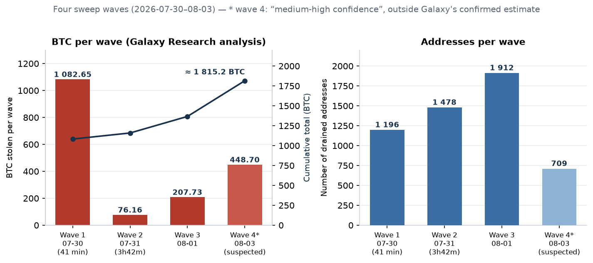
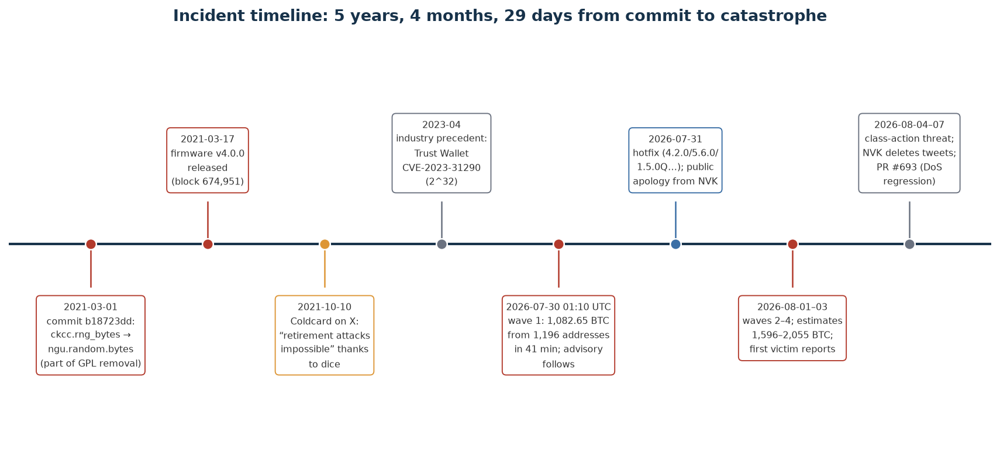
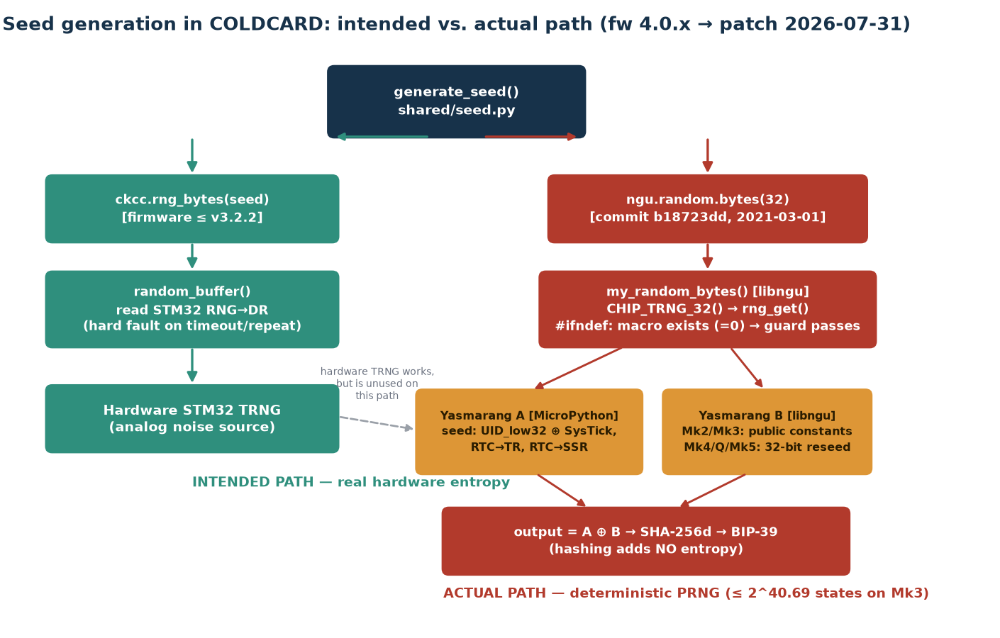
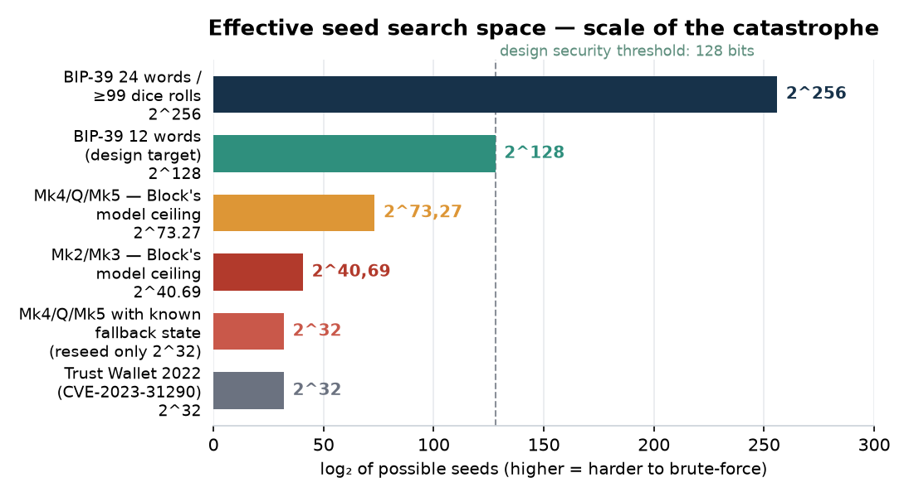
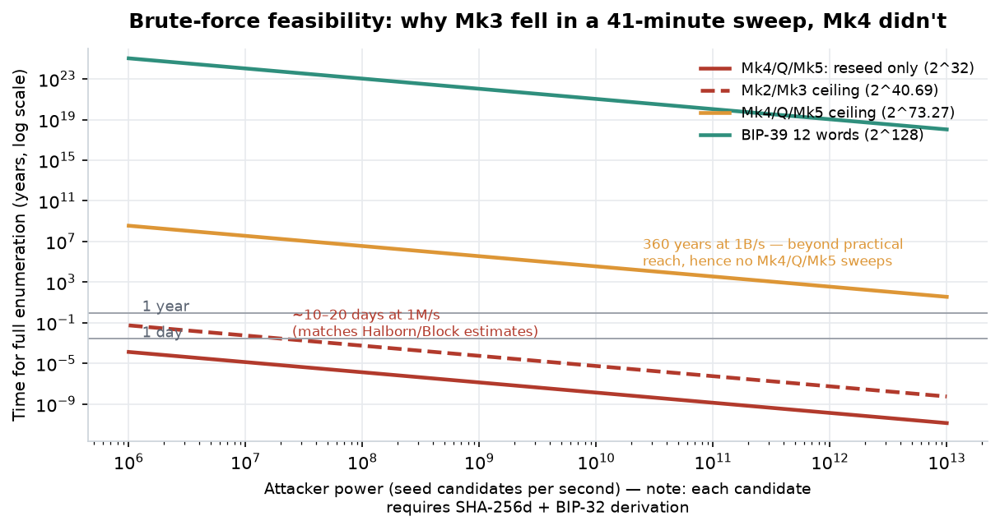

# The Coldcard Entropy Hack (July–August 2026): A Critical Engineering Analysis of the Incident, Seed Technology, and the Limits of the BTC Self-Custody Model

**Document type:** engineering-grade research report (deep research) — root-cause analysis, mathematical reconstruction of the search space, industry context, defensive recommendations.
**As of:** August 10, 2026 (updated — see Section 10)

---

## 1. Executive Summary

On Thursday, **July 30, 2026**, in a window of **41 minutes (01:10:20–01:51:26 UTC)**, an unknown actor drained **1,196 Bitcoin addresses**, taking **1,082.65 BTC (~$70.2M)** — without physical access to any device, without breaking a PIN, without attacking the Bitcoin protocol itself [^43^][^6^]. In the following days at least three further waves occurred; confirmed estimates from Galaxy Research put the toll at **1,596 BTC from ~7,300 addresses**, and a scenario including a fourth wave raises the total loss to **2,055 BTC (~$130M)** [^56^][^54^]. This was the largest known hardware-wallet exploit in history and the third-largest crypto hack of 2026 [^15^].

The root cause was not spectacular in a cryptographic sense — it was trivial in an engineering sense, and that is precisely what makes it so alarming. On **March 1, 2021**, in commit `b18723dd`, Coinkite migrated seed generation from its own `ckcc.rng_bytes()` function (which reached down to the STM32 microcontroller's hardware TRNG) to `ngu.random.bytes()` from the libngu library [^18^]. Due to a preprocessor guard bug — an `#ifndef` that checked the **existence** of the `MICROPY_HW_ENABLE_RNG` macro rather than its **value** — the `rng_get()` symbol resolved at link time to the software fallback generator **Yasmarang**, seeded from the chip's unique identifier and clock registers [^18^][^13^]. The effect: for **5 years, 4 months and 29 days**, wallets generated mnemonics that looked random but whose effective search space was **≤ 2^40.69 on Mk2/Mk3** and **≤ 2^73.27 on Mk4/Mk5/Q**, instead of the designed 2^128 [^13^][^7^].

This report answers six questions: **what happened** (reconstruction of the waves and their scale), **why** (engineering, organizational, and cultural analysis), **how seed technology works** (formal foundations of BIP-39/BIP-32, TRNG vs. PRNG), **what the owner did and said** (Rodolfo Novak's crisis communication and his history of attacking competitors), **what the precedents were** (Trust Wallet, Dark Skippy, Kraken vs. Trezor, Ledger Recover), and **how to protect yourself** (migration, dice, passphrase, multisig, engineering hygiene). The central thesis: hardware-wallet security is decided **in the millisecond the seed is generated**, and every later layer — air-gap, secure elements, steel backups — is secondary to the quality of that entropy [^1^].

---

## 2. Scale and Course of the Attack: Four Waves and the Anatomy of a Sweep

### 2.1. On-Chain Reconstruction

The attack was not a single exploiting transaction — there was no "smart contract with a hole," no break-in into Coinkite's infrastructure. Over weeks or months, the attacker **reconstructed candidate seeds offline**, derived addresses from them, and compared them against the public UTXO ledger, then executed a coordinated "sweep" of the compromised wallets using ordinary, valid transactions [^13^][^4^]. Galaxy Research reconstructed the first wave: 1,196 addresses drained in full, with no change outputs, at a **fixed, hard-coded fee of 30 sat/vB**, across six blocks [^43^][^26^]. The second wave (27 hours later, 76.16 BTC from 1,478 addresses over 3h42m) mostly used 10 and 50 sat/vB; the transaction fingerprints of the first two waves point to a single operator or a single tool, while the third breaks the pattern [^43^][^42^].

"Genetic" evidence confirmed the link to the bug: all **3,953 stolen coins** from the first two waves were minted (created) **after block 674,951** — i.e., after March 17, 2021, the release date of the vulnerable firmware v4.0.0; the oldest coin in wave one comes from block 675,955, and in wave two from block 675,829 [^43^]. This is a timing signature exactly consistent with the vulnerability window: the attacker reconstructed only seeds generated by the flawed firmware.

| Wave | Date/time (UTC) | Addresses | BTC | Characteristics |
|---|---|---|---|---|
| 1 | 2026-07-30, 01:10–01:51 (41 min) | 1,196 (later corrected to 1,195) | 1,082.65 | fixed 30 sat/vB fee, no change, 6 blocks [^43^][^5^] |
| 2 | 2026-07-31 morning (3h42m) | 1,478 | 76.16 | mostly 10/50 sat/vB, victim set disjoint from wave 1 [^43^] |
| 3 | 2026-08-01 | 1,912 | 207.73 | different transaction fingerprint — different actor or changed tactics [^42^][^4^] |
| 4 (suspected) | 2026-08-03 | ~709 | ~448.7 | "medium-high confidence," excluded from Galaxy's confirmed estimate pending victim confirmations [^56^][^5^] |



### 2.2. Discrepancies in the Estimates, and Why They Are Unavoidable

Bitcoin identifies addresses, not people or device models — attributing a sweep to the Coldcard bug rests on heuristics (full drains with no change, similar input types, tight time windows, repeated fees, shared destinations, later co-spending) and on victim reports, not on a cryptographic reproduction of every seed [^13^]. That is why the numbers differ between trackers, and they should be presented as ranges with methodology, not as a single "truth."

| Source / tracker | As of | Estimate | Method |
|---|---|---|---|
| Galaxy Research (confirmed) | 2026-08-03/04 | **1,596 BTC** from ~7,300 addresses (3 waves + 14 smaller incidents; 73 victim reports) | on-chain + private victim channel [^56^] |
| Galaxy Research (incl. wave 4) | 2026-08-04 | up to **2,055 BTC** (~$130M) | as above, wave 4 "medium-high confidence" [^56^][^54^] |
| Coldcard Sweep Watch (verified minimum) | 2026-08-07 | **1,405.07 BTC** from ~4,925 addresses | public methodology, confirmed clusters only [^13^] |
| coldcard.rip (wave attribution) | 2026-08-03 | **1,433.13 BTC** from 5,477 addresses, **10 waves** | wave classification with routes and fees [^13^] |
| TRM Labs | 2026-08-05 | ~**1,816 BTC** (~$116M), 5,200+ addresses, 4 waves | blockchain analytics + multi-actor indicators [^15^] |
| Halborn | 2026-08-07 | ~7,300 addresses, losses >$130M | public synthesis [^10^] |

More than **90% of the stolen funds have not moved** since the theft — coins from the first three confirmed waves have sat untouched on attacker-controlled addresses, unusual at this scale, giving investigators a window to coordinate with exchanges and law enforcement [^54^][^9^]. Differences in transaction construction between waves lead TRM and Galaxy toward a hypothesis of **multiple independent actors** (TechCrunch says "at least a dozen" hackers, crypto.news says 15+) who, after the mechanism became public, went hunting before users could migrate their funds [^12^][^9^]. At the peak of the fourth wave, ~**13.8 sweeps per block** were observed, versus ~0.3 before the incident [^54^].

### 2.3. Victims and the Human Scale

The loss profile was inversely proportional to a typical exchange hack: by count, sub-1-BTC addresses dominated, but by value, larger balances did — meaning **individual self-custody hodlers**, not institutions [^43^]. The iconic story became Canadian entrepreneur **Jonathan Goodman**: 18.25245667 BTC (~1.6M CAD) on a Coldcard kept in a bank vault, drained in 7 minutes (07/29, 21:36–21:43 local time — exactly within wave 1's UTC window) [^28^][^34^]. His post — *"The hardest part is that I did everything right. I never gave anyone the seed phrase. The devices never touched the internet"* — was viewed by 7.6 million users on X and became a symbol of the incident: victims followed the textbook self-custody ritual (buying from a reputable manufacturer, generating offline, steel backups, never typing the phrase into anything online) and lost purely because **the manufacturer botched the randomness** [^28^][^12^]. Podcaster Guy Swann called the event *"the biggest blow in Bitcoin's history aimed at the most switched-on, 'properly secured' hodlers"* [^26^].



---

## 3. Anatomy of the Bug: Root-Cause Engineering Analysis

### 3.1. The Intended Architecture vs. the Actual Call Path

Coldcard was designed on the assumption of **no software fallback**: the seed was to come exclusively from the STM32 peripheral's hardware TRNG, with a hard fault on timeout or a repeated sample; the board's production configuration deliberately set `MICROPY_HW_ENABLE_RNG (0)` to disable MicroPython's built-in RNG path — because Coinkite supplied its own wrapper `random32()`/`random_buffer()`, exposed to Python as `ckcc.rng_bytes` [^18^][^21^]. In firmware v3.2.2, wallet generation was correct end-to-end: `make_new_wallet() → ckcc.rng_bytes(seed) → random_buffer() → STM32 RNG→DR → SHA-256 → BIP-39 words` [^13^].

The change came with the migration of elliptic-curve operations to libsecp256k1 from Bitcoin Core and the introduction of the libngu layer (MicroPython). Commit `b18723dd` from **March 1, 2021** swapped:

```python
# v3.2.2 (correct)                 # v4.0.0+ (vulnerable)
seed = bytearray(32)                seed = random.bytes(32)
rng_bytes(seed)                     # → ngu.random.bytes → libngu
```

and `shared/random.py` mapped this call to `ngu.random.bytes` [^18^]. The change shipped in release **v4.0.0 (2021-03-17)**; Coinkite's official advisory's confirmed scope covers Mk2/Mk3 **4.0.1–4.1.9**, while Block's source-code analysis also includes v4.0.0 — given this boundary discrepancy, a conservative posture should be assumed [^7^][^1^].



### 3.2. One Character: `#ifndef` Instead of `#if`

Libngu tried to guard against exactly this scenario — a compile-time guard was meant to **refuse to build** if the hardware TRNG were unavailable:

```c
extern uint32_t rng_get(void);
#define CHIP_TRNG_32() rng_get()

#ifndef MICROPY_HW_ENABLE_RNG
#error "get a HW TRNG plz"
#endif
```

The problem lies in the semantics of `#ifndef`: it tests whether a definition **exists**, not whether it is true. The macro in the production `mpconfigboard.h` **does exist** — with a value of `0`. So the guard silently passed on every build for more than five years; as the Wizardsardine team aptly put it, *"a single character separated this guard from its purpose: `#if` instead of `#ifndef`"* [^24^]. Because the board-local implementation exported `random32()`/`random_buffer()` rather than the global `rng_get()` symbol, libngu's reference resolved at the linker level to the MicroPython implementation — where the selector `#if MICROPY_HW_ENABLE_RNG` (this time checking the **value**) took the `#else` branch: the software Yasmarang [^18^][^13^].

This explains the paradox that long confused commentators: **the hardware TRNG was present, functional, and used by other firmware functions** for the entire vulnerability window. Code reviews could confirm the generator existed and was invoked "somewhere" in the code — nobody verified the end-to-end symbol resolution from the seed-generation call site to the actual entropy source [^9^]. The bug lived **at the linker level, not in readable source**, making it a textbook example of a failure at an integration seam [^52^].

### 3.3. Two Yasmarangs: Where the "Randomness" Came From

Yasmarang is a general-purpose PRNG built into MicroPython (upstream, May 2018) — non-cryptographic, designed for development boards without hardware RNG [^21^]. On the vulnerable path, **two** instances ran, and the result was their XOR [^13^]:

```c
// Yasmarang A — MicroPython fallback behind rng_get(); one-time init:
pad = *(uint32_t *)MP_HAL_UNIQUE_ID_ADDRESS ^ SysTick->VAL;
n   = RTC->TR;      // real-time clock time-of-day
d   = RTC->SSR;     // RTC sub-seconds

// Yasmarang B — libngu's own state; on Mk2/Mk3, public constants only:
static uint32_t yasmarang_pad = 0x0a8ce26f, yasmarang_n = 69, yasmarang_d = 233;

uint32_t chip = CHIP_TRNG_32();   // = rng_get() → Yasmarang A
chip ^= my_yasmarang();           // Yasmarang B
```

Each of these streams is deterministic once the initialization parameters and the number of prior calls are known; the XOR of two reproducible streams is itself reproducible — **XOR does not create entropy** [^18^]. The built-in "health checks" also passed: libngu's `chip == last` check rejected adjacent repeats (a PRNG normally doesn't produce them), and the `len(set(seed)) > 4` assertion in `generate_seed()` only catches trivial generator lock-ups [^18^][^24^]. This is exactly why the incident is a lesson about **false confidence from statistical tests** — those tests verify properties of the stream, not its unpredictability to an outside observer.

What matters for the attacker's model: `UID_low32` is not a secret — it's production metadata baked into the chip. The Wizardsardine team notes that the UID slice used encodes the die's physical coordinates on the silicon wafer (lot/wafer numbers, X/Y coordinates) and *"likely fits within a 16-bit space,"* not even providing the full 32 bits of variability nominally claimed; moreover, `UID_low32 ⊕ SysTick` collapses into a single 32-bit `pad` anyway — nominal input bits **cannot simply be added together** [^24^][^13^].

### 3.4. Reconstructing the Numbers: Where 40 and 72 Bits Come From

Following Block's and BlockSec's methodology, "~40 bits" for Mk2/Mk3 is an **enumeration ceiling assuming a known UID and independent clock fields**, not cryptographic entropy in the NIST sense [^13^]:

| Initialization input (Mk2/Mk3) | Candidates | Enumeration cost |
|---|---|---|
| `UID_low32` known (chip metadata) | 1 | 2⁰ |
| `SysTick->VAL` at boot | 80,000 | 2^16.29 |
| `RTC->TR` (second of day) | 86,400 | 2^16.40 |
| `RTC->SSR` (sub-seconds) | 256 | 2⁸ |
| **Combined ceiling** | 80,000 × 86,400 × 256 = 1,769,472,000,000 | **2^40.69** (avg. 2^39.69) |

If the RTC registers are static on a typical cold boot, only SysTick remains: the ceiling drops to **~2^16.29**; with a known UID, timers, and call history, there is **exactly one stream (2⁰)** [^13^]. It is also crucial to note that generating eight 32-bit words for a 256-bit seed does **not multiply** the search space — every word is a function of the same initial state [^13^].

For Mk4/Q/Mk5, the picture was "better" and, at the same time, more perverse. Boot added material from the secure elements, but `rng_seeding()` hashed 40 bytes (32 B from SE1, 8 B from SE2), **kept only 4 bytes of the digest**, and passed that to `reseed()`, which replaced only a single 32-bit word `pad` in generator B [^18^][^13^]:

```python
a = callgate.read_rng(1)   # 32 B from SE1 (authenticated)
b = callgate.read_rng(2)   # 8 B from SE2 (ROM-options side)
n = ngu.hash.sha256d(a + b)
n, = ustruct.unpack('I', n[0:4])   # ← only 32 bits get through
ngu.random.reseed(n)               # ← replaces ONLY yasmarang_pad
```

The rest of generator B's state held public values, and the MicroPython fallback (A) wasn't reseeded at all. Hence "~72 bits": 2^41.27 timer states (120,000 × 86,400 × 256) × 2^32 reseed values gives a ceiling of **2^73.27**, average attack work **2^72.27**; but with a known fallback state (target's UID + timers), only **2^32 reseed values remain — an average of 2^31 attempts, i.e., trivially enumerable** [^13^][^24^]. Block called this construction a *"dangerous fail-open pattern"*: an exception early in boot, before the reseed executed, would leave the device in a known public initial state with zero added entropy [^3^]. The final SHA-256d hashing of 32 bytes in `generate_seed()` — nor the BIP-39 checksum — **cannot expand the size of the possible input family**: ≤ 2^32 candidates in yields ≤ 2^32 candidates out [^18^].

### 3.5. The Mathematics of the Catastrophe, and Its Computational Verification

The charts below compare effective search spaces and enumeration time; the values were independently recalculated for this report and are consistent with source estimates (Halborn: ~13 days at 1M keys/s for ~2^40; BlockSec: 2^40.69/2^73.27) [^10^][^13^].





Three numerical conclusions organize the whole incident. First, **Mk3 was doomed by definition**: full enumeration of 2^40.69 at 1M candidates/s is ~20.5 days (average ~10 days), and at a 1B/s cluster — ~20 minutes; the attack required no exotic techniques, just patience and paid access to blockchain data for mass balance checking [^10^][^4^]. Second, **Mk4/Q/Mk5 were saved by arithmetic, not architecture**: a ceiling of 2^73.27 at 1B/s is ~361 years, which is why sweeps of these models did not appear — but the "known fallback state" mode reduces them to 2^32, i.e., minutes; that is why Coinkite correctly classified them as affected too (72 bits instead of 128) and mandated migration [^7^][^13^]. Third, the cost per candidate isn't pure random generation but SHA-256d + BIP-32 derivation + address computation — which slows the attack down, but as Ledger Donjon's practical work on Trust Wallet showed, at 32 bits the entire "mnemonic → address" map is a matter of minutes [^51^].

---

## 4. Seed Technology: the Formal Foundations That Failed (and the Ones That Worked)

### 4.1. BIP-39 and BIP-32: What Actually Gets Randomized

The security of an HD (hierarchical deterministic) wallet begins with a single number. BIP-39 generates **entropy (ENT)** 128–256 bits long, appends a checksum CS = ENT/32 leading bits of SHA-256, splits the result into 11-bit groups, and maps them to words from a 2,048-word dictionary: 12 words carry 128 bits of entropy (+4 checksum bits), 24 words carry 256 bits (+8 checksum bits) [^2^]. The mnemonic then passes through **PBKDF2-HMAC-SHA-512 with 2,048 iterations** and the salt `"mnemonic" + passphrase`, yielding a 512-bit binary seed; from it, BIP-32 derives a key tree via HMAC-SHA-512 (hardened and normal derivation), with leaf keys living on the **secp256k1** curve. The consequence is fundamental and often underappreciated: **the BIP-39 checksum, hash functions, and HD derivation itself add not a single bit of entropy** — if ENT is weak, the entire superstructure is weak in a hereditary way, because every address of every account and path is a function of that same ENT [^18^][^19^].

Hence the asymmetry this incident brutally exposed: an attack on the seed is a **passive, offline, and scalable** attack. The attacker doesn't need to touch the device, phish the user, or break the PIN — it's enough to narrow the set of candidate ENT values and compare their images (addresses) against the public ledger [^15^]. This shifts the entire weight of security to the moment of generation and the quality of the randomness source — consistent with the observation that *"a wallet's fate is decided at the moment the seed is created, before PINs, steel plates, or air-gaps ever come into play"* [^1^].

### 4.2. TRNG, PRNG, CSPRNG, DRBG — a Taxonomy Whose Violation Cost $130 Million

Cryptographic engineering enforces a strict separation: a **TRNG** (true random number generator) draws entropy from physical phenomena (analog noise, oscillator jitter — on the STM32, an analog noise source validated via the `RNG_SR` registers); a **PRNG** is a deterministic state machine (Yasmarang, Mersenne Twister) with a finite state space; a **CSPRNG/DRBG** is a cryptographically designed automaton (e.g., NIST SP 800-90A constructions: Hash_DRBG, HMAC_DRBG, CTR_DRBG) that, given a secret and sufficiently entropic seed, produces output indistinguishable from random. The **NIST SP 800-90B** family of standards defines requirements for entropy sources: min-entropy estimation, source health tests (repetition count, adaptive proportion), and continuous monitoring of the noise source; the German AIS-31 is a similar industry benchmark. The Coldcard incident was a **layer substitution**: where a CSPRNG seeded from a TRNG was required, we found a plain PRNG seeded from data that wasn't secret at all — which in CWE taxonomy corresponds to CWE-338 (Use of Cryptographically Weak PRNG), the same class as CVE-2023-31290 in Trust Wallet [^48^][^41^].

A key design principle that failed here is **fail-closed**: if the desired entropy source is unavailable, the system should refuse to operate, not "quietly" degrade to a substitute. The `#error "get a HW TRNG plz"` guard was an attempt at fail-closed, but written via `#ifndef` it became fail-open — and in a **silent** variant at that: the device didn't crash, mnemonics looked normal, statistical tests passed [^24^]. A second principle is **mixing independent sources with conditioning**: the correct pattern is, e.g., `seed = KDF(TRNG ‖ SE ‖ user data)`, where compromising one component doesn't degrade the result; Coldcard *claimed* this pattern (TRNG + two SEs + optional dice), but due to an integration bug, of the 40 bytes coming from the secure elements, only **4 bytes** reached the generator's state [^18^][^13^].

### 4.3. The Role of Secure Elements in Coldcard — What Held, and What Didn't

The Coldcard Mk4 (and later Mk5) architecture is built around **two secure elements from two different vendors** — Microchip's ATECC608B and Maxim's DS28C36B — plus an STM32 microcontroller; the master secret is cryptographically split across all three chips, so that extracting it would require breaking all of them at once [^53^]. On top of that: PIN splitting into two parts with **anti-phishing words** rendered from SE secrets, firmware-signature verification at boot with a hardware-driven "genuine" LED controlled by the SE, a transparent case for easier PCB inspection, and duress and brick-me PINs [^27^][^29^]. This model has historically withstood physical attacks well: in 2023, Ledger Donjon managed to laser-read part of the DS28C36 (SE2) EEPROM, but **full master-seed recovery was not demonstrated**, since material from SE1, SE2, and the MCU is required simultaneously [^44^].

In the July catastrophe, this layer **held completely** — and that is precisely the bitter engineering irony of the event. No secure element was broken, key storage was not attacked, the PIN was not bypassed. The storage system was inviolable; what failed was the **birth** of the secret five years earlier, in a 30-millisecond window at first boot, in a firmware layer that no laser was ever needed to touch [^15^]. This is an important lesson in prioritization: the most "exotic" defense layers (anti-tamper, glitch detection) protect against attacks that require a lab, while an ordinary `#ifdef` bug offers an attacker global scale from a laptop.

### 4.4. User-Supplied Entropy: Dice, Passphrase, Multisig, SeedXOR

Coinkite has for years promoted the **Add Dice Rolls** feature — the user rolls a physical six-sided die and enters the results, and the firmware hashes the sequence of rolls together with device material. Each roll contributes log₂6 ≈ 2.585 bits of independent entropy: **50–98 rolls give ≥128 bits, 99+ rolls give ~256 bits** — and the advisory confirms that seeds created with ≥50 honest, independent, private rolls **are not at risk** from this bug, because the flawed generator was, at that point, merely a harmless ingredient in the mix [^7^]. The conditions matter: the rolls must be physical and fair, not recorded, not photographed, not dictated by a third party — any digital trace turns the user's entropy into forgeable data [^7^][^5^].

**BIP-39 passphrase** (the so-called 25th word) works differently: it does not fix the seed, but instead creates, via PBKDF2, a **separate wallet**; an attacker enumerating seeds lands on empty "bare" wallets, while funds behind a strong, unique passphrase sit outside the reach of pure seed enumeration [^13^][^7^]. Two rational concerns remain: first, PBKDF2 at 2,048 rounds is weak stretching by modern hardware standards, so a short or predictable passphrase can be cracked once the seed is already known — a weak seed additionally narrows the passphrase search, which can buy hours or days but doesn't solve the problem [^26^]; second, a passphrase becomes a single point of loss (forgotten = funds gone). That's why the advisory treats passphrase as a time-buying barrier and still mandates migration for its users too [^7^].

**Multisig** (e.g., 2-of-3) reduces single-vendor risk only when the quorum isn't composed entirely of affected devices — a multisig made purely of vulnerable Coldcards achieves nothing, whereas a cross-vendor multisig means one line of buggy code from one supplier isn't enough to reach the signing threshold [^11^][^24^]. The cost is operational complexity: xpubs, derivation paths, descriptor files, separate backups, inheritance planning. The Coldcard ecosystem also has **SeedXOR**: a mathematical split of the seed into parts (XOR-ing the components reconstructs the secret), an alternative to a simple backup split; it protects the backup against physical theft, but — like any deterministic transformation — it does not heal weak source entropy. The same caveat applies to **BIP-85** (deriving child seeds from a single root): the children inherit the quality of the root [^47^].

---

## 5. Why This Happened: Three Layers of Causes

### 5.1. The Technical Layer: A Chain of Small Decisions, Each "Reasonable" on Its Own

No single decision was outrageous; their combination was lethal. The migration to libsecp256k1 was substantively justified (a library from Bitcoin Core, the most thoroughly reviewed EC implementation in the world). A custom RNG wrapper instead of the MicroPython path — justified (control over the entropy source). Setting `MICROPY_HW_ENABLE_RNG (0)` — a consequence of the previous decision. The guard in libngu — good intent, wrong directive. Changing `generate_seed()` to the more convenient `random.bytes(32)` — a single line inside a commit spanning ~120 files, whose main narrative purpose was to remove GPL code [^26^][^18^]. Reviewers read a "crypto library diff," not an "entropy-generation-system diff"; the hardware RNG shone through elsewhere in the codebase, so quality control got a false-positive signal [^9^].

On top of this comes a **bottomless process gap**: no end-to-end test ever measured the actual entropy of seeds produced by the final firmware image — and this would have been a trivial control (e.g., generating N seeds on reference hardware with a known UID and checking for collisions/predictability, or a build-time assertion on the provenance of the `rng_get` symbol) [^52^]. The static tests that did exist (adjacent-repeat checks, byte diversity) were structurally incapable of detecting determinism — a PRNG passes them by definition [^18^].

### 5.2. The Organizational Layer: A License That Switched Off "Many Eyes"

The licensing angle is a documented backdrop to the critical commit. According to a timeline published by Foundation Devices CEO Zach Herbert: on July 28, 2020, the Foundation team unveiled the Passport wallet, built on Coldcard firmware then distributed under **GPLv3**; two days later, Novak announced a change in licensing direction, and in November 2020, Coinkite switched to **MIT + Commons Clause** — a clause banning commercial use of derivatives, which makes the code "publicly viewable" but not free/open-source under accepted definitions [^26^][^5^]. On **March 1, 2021**, a commit removing "the last remaining GPL code" (including libraries inherited from Trezor), within that same ~120-file package, changed seed generation; two weeks later, v4.0.0 shipped [^26^].

There is no evidence of malice — but there is a measurable structural effect: publishing code creates **conditions** for review, not review itself. It made no economic sense for outside experts to spend weeks auditing a library they legally couldn't use in their own products; in practice, the critical RNG path waited five years for deep reading [^26^][^5^]. The incident itself has become the best-known counterargument to the shorthand "public code = audited code" — a point also underscored by Tangem CTO Andrew Lazutkin: open-source firmware **should not be automatically equated with better security** [^17^].

### 5.3. The Cultural Layer: Marketing Orthodoxy and a "Retirement Attack" That Happened to Itself

Coldcard built its brand on being the "guardian of orthodoxy": Bitcoin-only (everything else is "a scam"), air-gap as a fetish (USB = "one click from losing everything"), the slogan **"Sleep at Night Technology"** [^26^]. In October 2021 — **seven months after the bug was already in production code** — Coldcard's official X account explained the concept of a *retirement attack*: *"this is when a project's creators could leave a 'bug' in entropy generation to later seize funds"* — and claimed that thanks to dice, Coldcard made such an attack **impossible** [^26^][^22^]. That tweet was never deleted and survives as self-parody: the company correctly described the risk class, offered a working mitigation (indeed — 50 dice rolls protected users who used them [^7^]), but failed to close the default path most of its customers actually used.

Against this cultural backdrop lies a reinforcement mechanism: Coldcard was one of the most frequently recommended wallets in the community (Reddit hosts an 11-minute compilation of influencer recommendations), so the vulnerability landed squarely on the cohort of **the most security-conscious, wealthiest long-term hodlers** — which explains the unusual, "individual" profile of victim addresses [^26^][^43^]. After disclosure, CryptoQuant recorded an outflow — into self-custody? The opposite: a spike in small exchange deposits to 7,300 BTC daily, active addresses jumping from ~645,000 to ~1M, and 39,600 BTC in sub-1-BTC transfers — behavior last comparable to FTX's bankruptcy day, only in the opposite direction [^26^].

### 5.4. A New Factor: the AI Paradigm

In his communications, Novak named as a real suspect **AI-assisted code review**: *"AI can now find latent bugs faster than even the most seasoned experts; if your firmware is public, assume attackers and defenders alike are already reading it"* [^8^][^17^]. The thesis has some empirical backing: community members claimed Claude Code and GLM-5.2 found the flawed RNG path in ~8 and ~20 minutes respectively (tests not independently reproduced), Coinkite admitted it had previously used AI review itself and **failed to catch** the bug, and a parallel wave of AI audits of other wallet codebases uncovered 85 further critical entropy-handling defects [^5^][^9^]. The broader context is telling: on May 29, 2026, researcher Taylor Hornby used Claude Opus 4.8 to find a dormant flaw dating to 2022 in Zcash Orchard enabling silent ZEC forgery, and Anthropic reported cryptanalysis of HAWK and 7-round AES-128 with the help of Claude Mythos [^26^]. Critics rightly point out that a build flag disabling the TRNG is a **human engineering failure** that a conventional review should have caught years before any model came along [^17^] — but that doesn't change the fact that the economic threshold for mass offensive auditing of public code just collapsed, which is a cold shower for every vendor.

---

## 6. The Owner Under the Microscope: Rodolfo Novak (NVK) — Posts, Jabs, and Contradictions

### 6.1. Crisis Communication, Step by Step

The timeline of the first hours is unflattering for Coinkite. **Kevin Loaec of Wizardsardine** publicly warned users of the anomaly at **17:35 UTC on July 30**; **at 18:10 UTC, Novak replied that "there is no reason to panic"** — while coins were already moving; that tweet vanished, and NVK later admitted it contained "incorrect" information [^52^][^22^]. Coinkite's advisory appeared ~30 hours after the sweeps began [^42^]. On July 31, NVK published (and pinned — it is still up) a full apology: *"I'm sorry and I'm devastated… We take full responsibility for the firmware bug,"* with a list of actions: a hotfix removing the fallback, seed migration, support for police and insurance reports, and cooperation with on-chain investigators [^25^]. In the following days, the company destroyed its remaining stock of devices running the flawed firmware and paused shipments [^8^][^20^].

At the same time, two elements of the communication were viewed by the community as **evasive or "cheap" in effect**. The first was shifting the narrative burden onto the "AI paradigm" — true as an industry warning, but functioning rhetorically as a shift of blame from an engineering fracture onto "the times we live in" [^17^]. The second was the **data-retention** matter: to warn customers, Coinkite sent emails to buyers **going back to 2019** — while it had previously stated it wiped data after ~90 days (Halborn says 120 days); as one comment put it, "a privacy-first brand can't quietly hold seven years of customer data and only reveal it during a crisis" [^52^][^10^]. On August 7, a blog note appeared about a "temporary change to data-retention and customer-data-blanking practices" [^47^].

### 6.2. Deleted Posts and the "Receipts" Archive

In the first week of August, NVK began **selectively deleting historical posts**. The best-documented case: a November 2024 tweet suggesting that a counterfeit Blockclock (a Coinkite product) could be *"a backdoor into people's home networks"* — vanished; Bitcoin Core developer Peter Todd published a screenshot from his phone's cache on August 5 [^22^]. Also deleted: a post calling Erin Malone a "Lightning influencer" after she pushed back on the thesis that "Lightning barely works" — Malone commented: *"besides the hardware competitors he tried to trample, he went just as hard after Lightning"* [^22^]. Coinkite critic Greg Tonoski accused the company of removing the entry *"Unnamed v.4.0.0 security issue"* from its historical-disclosures page (the company responded to the accusation, so the question of improper removal is disputed; the Wayback Machine has no snapshot of that URL) [^22^]. Zach Herbert noted an asymmetry: it is NVK's posts being deleted, not those of the co-founder (@switck/@DocHex) — *"I assumed a litigation hold was in place, in which case NVK wouldn't be deleting tweets"* [^22^]. A volunteer archive, `nvk.wtf/receipts`, sprang up [^22^].

### 6.3. A History of "Slinging Venom" at Competitors — A Chronicle

NVK's marketing relied for years on aggressive criticism of rivals; after the incident, those words came back to him like a boomerang:

| When | Target | Content / event |
|---|---|---|
| 2019–2025 | Trezor | criticism of the lack of a secure element, FUD about the architecture; later, on the Trezor Safe 7 (2025-10-24): *"Funny how after years of FUD, they end up borrowing the multi-SE concept from COLDCARD… Bluetooth is garbage… 'quantum-ready' is marketing mush… painting it orange doesn't make a shitcoin-scam less of a scam"* [^26^] |
| 2020 | Foundation Passport | accused of "borrowing" Coldcard firmware (Passport started on GPLv3); the conflict ended with Coinkite's switch to the Commons Clause license [^26^] |
| repeatedly | SeedSigner (DIY) | criticism of using a Raspberry Pi as a signing device [^26^] |
| repeatedly | Lightning Network | public claims that "Lightning barely works," clashes with commentators [^22^] |
| 2023 | Ledger (industry context) | NVK was among the loud critics of Ledger Recover — a service splitting the seed into 3 fragments held by KYC'd custodians, introduced via a firmware update against the prior promise that "the key never leaves the device" [^37^][^38^] |

After July 30, 2026, the community's response was harsh. User Seed (@sesi_the_man) published a 4-minute compilation of years of "trolling and FUD" with the comment: *"he should have spent more energy checking his own work than dunking on everyone else's"* [^26^]. Some commentators (ForkLog) went further, diagnosing **"toxic maximalism" as an indirect cause of the disaster**: a culture of self-assurance and dismissiveness toward other people's threat models fosters organizational blindness to one's own [^26^]. Two things should nonetheless be separated: NVK's marketing jabs were often substantively not wrong (Trezor genuinely lacked an SE — which Kraken Security Labs exploited to extract a seed via voltage glitching in ~15 minutes with physical access [^30^]; Ledger Recover genuinely broke an architectural promise [^38^]). **The problem isn't the content of the criticism, but the asymmetry of standards**: Coldcard turned out to be more "hackable" than the devices it mocked, and in the worst possible layer — key generation [^15^].

### 6.4. Balance Sheet: What Was "Cheap" in the Owner's Behavior, and What Was Exemplary

For fairness, let's separate the assessment. **Exemplary**: a fast patch for all models and paths (07/31), a clear advisory with the rule "what matters is the firmware in place at the moment the seed was generated," an honest admission that an update doesn't fix an already-generated seed, an offer of documentation for police and insurers, and cooperation with trackers [^25^], destruction of the defective stock [^8^]. **Questionable**: the initial "no need to panic" while a drain was in progress [^52^]; the AI-as-co-culprit narrative [^17^]; the data-retention contradiction [^52^]; the mass deletion of posts (including ones about competitors) at a time when a litigation-hold standard should have applied [^22^]; and — most damaging in symbolic terms — the 2021 declaration that an attack on entropy was "impossible," made at a moment when the attack had already been baked into every newly generated seed for seven months [^26^]. None of this proves bad faith, but it documents a mechanism every engineering postmortem should name plainly: **the organization believed its own marketing faster than it believed its own verification pipeline**.

---

## 7. Precedents and Industry Context: the "Bad Entropy" Class Is Not New

The Coldcard incident is the largest, but not the first, well-documented representative of a class of failures — **compromise at the moment of generating or handling randomness**. The table below shows the industry had all the data it needed to foresee this scenario:

| Year | Product | Mechanism | Impact | Lesson |
|---|---|---|---|---|
| 2020 | Trezor One / Model T | no SE: voltage-glitching the STM32F2/F4 allows, in ~15 min with physical access, dumping flash and recovering the encrypted seed (Kraken Security Labs) | physical vulnerability; mitigation: BIP-39 passphrase | a seed without an SE needs a cognitive layer [^30^] |
| 11.2022–2023 | Trust Wallet (extension) | Mersenne Twister `mt19937` seeded with **32 bits** → ~4 billion mnemonics; Ledger Donjon detected it 3 days after launch; in-the-wild exploit XII.2022/III.2023 (CVE-2023-31290) | ~$30M at risk; full "address → key" map in minutes | a 32-bit seed is effectively a public key; hot wallet ≠ cold [^48^][^51^][^50^] |
| 2018→2024 | Trust Wallet iOS (legacy) | `trezor-crypto rand.c` seeded with `srand(time(NULL))` → search space = seconds (CVE-2024-23660) | wallets from 2018 reconstructable | time as a seed = zero entropy [^46^] |
| 2023 | Ledger (Recover) | firmware enables exporting the seed in 3 encrypted fragments to KYC'd custodians | crisis of trust, service delay, commitment to open-source the code | "the key never leaves the device" is a binary property [^37^][^38^] |
| 08.2024 | class of signing devices | **Dark Skippy**: malicious firmware embeds seed fragments in Schnorr signature nonces; extraction of 12 words in ~2 signatures via Pollard's Kangaroo | proof-of-concept on a laptop; mitigations: anti-exfil, firmware verification, multisig | a signature is a side channel — not just the RNG is at risk, but also the nonce [^32^][^36^] |
| 07–08.2026 | **Coldcard Mk2–Mk5/Q** | RNG fallback: Yasmarang from UID+timers instead of a TRNG; ≤2^40.69 / ≤2^73.27 states | **1,596–2,055 BTC** stolen; the largest HW-wallet exploit in history | seed generation fail-open for 5 years; an air-gap doesn't protect against a bad birth of the key [^15^][^13^] |

The collective conclusion is bleak: in all these cases, **Bitcoin's cryptography (secp256k1, SHA-256) remained untouched** — it was the engineering shell around it that failed: the PRNG seed, a compile flag, a signature nonce, the firmware trust model. Coldcard differs in scale and victim profile (the most secured hodlers) and in that, for the first time, a mass exploit required **zero** interaction with the victim or their device [^15^][^12^]. It's also worth noting that the community spent years fearing the wrong enemy: *"Bitcoin holders spent two years worrying that quantum computers would reach into cold storage… a compile flag got there first"* [^17^].

---

## 8. How to Protect Yourself: from Emergency Migration to Vendor-Resilient Architecture

### 8.1. Who Is (Was) at Risk — A Decision Matrix

What matters is exclusively the **device and firmware at the moment the seed was generated**, not the version installed today; importing a vulnerable seed into another wallet carries the weakness along with it [^7^][^11^]:

| Configuration | Status | Action |
|---|---|---|
| Seed on Mk2/Mk3 fw **4.0.1–4.1.9** (conservatively: from 4.0.0) without dice | **critically at risk** (~40 bits) | immediate migration of funds to a new seed |
| Seed on Mk4/Mk5 before **5.6.0** (Std) / **6.6.0X** (Edge) or Q before **1.5.0Q** / **6.6.0QX** | at risk (~72 bits) | priority migration |
| Seed with **≥50 honest, private dice rolls** | outside the reach of this bug | no action needed for this vector (note: independent "advanced feature" defects — see below) |
| Seed + **strong, unique BIP-39 passphrase** | funds outside pure seed enumeration | migrate anyway when convenient [^7^][^13^] |
| Multisig with a quorum partly made of other vendors | depends on quorum composition | migrate the vulnerable members [^11^] |
| Mk1 / seeds from before 2021 / TAPSIGNER, OPENDIME, SATSCARD | out of regression scope | no action [^7^][^13^] |

Additional note from the Wizardsardine team: regardless of the seed, on affected firmware, **advanced device features that use the RNG are also flawed**, and dice don't help there — so a firmware update is required even for owners of "safe" seeds [^24^].

### 8.2. Migration Procedure (Engineering Version, Based on the Manufacturer's Advisory)

Coinkite's advisory defines a safe ritual whose most important rule is: **stay calm and verify every step — rushing the migration can be more dangerous than the vulnerability itself** [^7^]. Sequence: (1) update the firmware to the patched version (Mk2/Mk3 ≥ 4.2.0; Mk4/Mk5 ≥ 5.6.0 Std / 6.6.0X Edge; Q ≥ 1.5.0Q Std / 6.6.0QX Edge — the Standard and Edge tracks are disjoint, and a higher Edge number does **not** mean it's patched); (2) on a blank device, generate a **new** seed, record it, and verify the backup and the XFP fingerprint; (3) verify the receiving address on the device's screen; (4) restore the old seed and send a **small test transaction**; (5) restore the new seed, confirm the XFP and that funds arrived; (6) only then move the rest; (7) keep the old backup until migration is fully confirmed [^7^]. Owners of a single Mk2/Mk3 can alternatively use the **dice-only** path (`Import Existing → Dice Rolls`, ≥99 rolls), which hashes only the roll sequence and does not use the device's generator — the roll sequence is secret key material: do not photograph it, do not save it digitally, do not type it into a computer [^7^].

There's also the matter of a "race": as long as the theft transaction sits in the mempool, a victim who still holds the key can try **Replace-by-Fee** with a higher fee — this only works before it's mined, and with no guarantee [^54^]. Coinkite retains customer data for a limited time and cannot reach most owners — hence the appeal for community-driven distribution of the warning [^10^][^25^].

### 8.3. Target Architecture: Configurations Resilient to Vendor Failure

For significant amounts, expert advice converges on one pattern: **don't let a single line of code from a single vendor be sufficient to cause a loss.** In practice: (a) **cross-vendor 2-of-3 multisig** with separate backups and a descriptor, with an equivalent of a recovery drill; (b) for single-sig — a seed generated with **user-supplied entropy** (≥50–99 rolls) or on a device with verifiable, up-to-date firmware; (c) a **BIP-39 passphrase** as an independent layer, backed up separately from the words; (d) splitting amounts: operational vs. deep cold storage; (e) periodic on-screen verification of receiving addresses (defense against address substitution on the host) [^11^][^24^][^7^]. Teams like Wizardsardine (Liana) document configurations with time-decaying keys and multisig as the default model for inheritance and long-term amounts [^24^].

For the fundamental paranoid question — "should you even use a hardware wallet at all?" — the incident's data suggest a nuanced answer: the Bitcoin protocol and the self-custody model itself **did not fail** — a specific vendor's specific RNG implementation did; at the same time, part of the market over-corrected, moving small amounts to exchanges (accepting counterparty risk instead of implementation risk) [^5^][^26^]. The engineering-correct response is not to abandon self-custody, but to **diversify trust**: multisig, user entropy, verifiable builds.

### 8.4. Verification Hygiene for Buyers and Maintainers

At the user level: buy only through official channels (supply-chain implants are a real attack class — Dark Skippy even assumes pre-compromised devices [^36^]); verify firmware checksums and signatures on update; follow the vendor's historical-disclosures page (Coinkite's page documents, among other things, Ledger Donjon's 2023 laser chain against the Mk3 and the partial SE2 read on the Mk4 — proof that coordinated research works [^44^]); treat every seed generated before the patch as compromised, **even if the balance is untouched** — attackers may be playing for time [^15^][^9^]. At the organizational level (companies, foundations holding BTC): inventory every seed against the matrix in §8.1, a four-eyes migration procedure, an incident policy/report (Coinkite issues victims written summaries for police and insurance purposes [^25^]), and monitoring of your own addresses with on-chain alerts — in this incident, hours mattered [^52^].

---

## 9. Consequences: Legal, Market, and Engineering

### 9.1. The Legal Dimension: the First Precedent-Setting Case for a "Faulty RNG"

A few days after disclosure, the threat of a **class-action lawsuit** began to take shape: Thomas Braziel (117 Partners) is analyzing product-liability claims and coordinating victims internationally; Brazilian holder Felipe Ojeda filed a police report and announced a complaint in Brazil [^31^]. Legal experts are divided on the odds: Cris Carrascosa (ATH21) points out that a non-custodial manufacturer has "zero regulatory liability over users' funds" and that proving foreseeability of harm will be difficult; Ana Ojeda (Blend), by contrast, sees credible grounds to examine product-defect and negligence claims [^31^]. Regardless of the outcome, the case may set a precedent for hardware-wallet manufacturer liability — until now, RNG-class incidents have ended in settlements or voluntary refunds (Trust Wallet promised compensation to exploit victims [^50^]). Coinkite — a company that raised two funding rounds back in 2013 and doesn't have Ledger's sales scale — is unlikely to be able to voluntarily compensate ~$130M, which victims understand [^31^].

### 9.2. The Market Dimension: a Dented Self-Custody Model

The scale of losses (~**$116–133M**, depending on tracker and the ~$64,700/BTC exchange rate as of 08/07 [^13^]) makes this the largest hardware-wallet exploit of 2026 and the third-largest crypto hack of the year (industry-wide losses exceeded $1.2B across 276 incidents) [^15^]. The on-chain reaction was immediate and paradoxical: active addresses rose from ~645,000 to ~1M, small exchange deposits spiked to 7,300 BTC — part of the hodler base re-priced its risk, preferring exchange counterparty risk to firmware implementation risk [^26^]. The incident did not damage Bitcoin's cryptography or the private-key model as such; it dented **trust in the claim "air-gapped = safe,"** showing that network isolation protects a secret after its birth, not during it [^5^][^2^].

### 9.3. Patch Regression: a Hotfix That Itself Needed Patching

A thorough engineering review must note a secondary episode: the July 31 hotfix, while restoring the hardware RNG path, introduced a **separate availability regression**. On the Mk4/Q family (STM32L4S), a seed error (SEIS) halts number generation, and `rng_get_or_fault()` did not implement the recovery sequence described in RM0432 (clearing SEIS, reading and discarding 12 words from RNG_DR, verification); the read loop only checked DRDY, so with the error latched, every attempt waited 10ms and threw `OSError(EFAULT)` — and key-order randomization happens **before login**, so the bug could block PIN entry and the update menu for the duration of a hardware session [^13^]. The strongest claim ("permanent bricking") was **not** confirmed: the RNG registers reset in hardware, and the community author of PR #692 analyzed the fault on a register mock and did not reproduce it on real hardware; PR #693, merged August 5, added limited recovery, retries, and rejection of suspect samples [^13^]. Lesson: even a critical fix made under time pressure needs regression testing on hardware failure paths — precisely the ones nobody tested for five years, because "the TRNG obviously works."

### 9.4. Implications for Security Engineering (a Design Checklist)

The incident hands the industry a canon of practices that should enter the standard for designing any signing device: (1) **entropy fallbacks must be fail-closed** — no HW RNG means refuse to generate a key, never silently fall back to a PRNG; (2) build-time guards must check **both the existence and the value** of macros; (3) **CI must verify symbol provenance** in the final image (from the `generate_seed` call site to the entropy source), not just that a TRNG implementation exists somewhere in the tree; (4) an **end-to-end entropy test** on every release: generate N seeds on a known UID/timers and prove unpredictability [^13^]; (5) noise-source health per **NIST SP 800-90B** (rep-count, adaptive proportion) plus full handling of peripheral errors per the manufacturer's documentation; (6) reseeding should initialize a **cryptographic DRBG** with the full material, not swap 32 bits of PRNG state [^18^]; (7) periodic, **independent verification of entropy** — a formal proposal made after the incident by Kraken's CSO, calling for mandatory entropy testing across all hardware-wallet manufacturers [^9^]. Hanging over all of this is a new audit reality: public code is now machine-read by attackers and defenders alike, and five years of a dormant bug is five years of free training material for an automated auditor "that never gets tired" [^52^][^5^].

---

## 10. Update: How the Situation Developed (August 8–10, 2026)

*The following section was appended to the original version of the report (as of 08/09) after re-searching the news on 2026-08-10. Footnote numbering continues from the previous section (new sources: 57–63).*

### 10.1. Updated Loss Tally: Galaxy Research Raises the Confirmation Bar

On August 8, Galaxy Research published a revised, **high-confidence** estimate: **1,719 BTC (~$111M)** confirmed across more than 25 recognized transaction patterns within the three main waves, while total losses (including unconfirmed waves) are still estimated at **>$130M** [^57^]. The analyst leading the community investigation under the handle @intangiblecoins reported receiving **more than 250 victim reports**, a significant share of which are still queued for verification — which by itself shows that the official figures remain a floor, not a ceiling [^57^]. The difference versus the August 4 figures (1,596–2,055 BTC, see the table in §2.2) illustrates a typical dynamic in incidents like this: the confirmed core grows slowly and conservatively, while the maximum estimate remains higher and more uncertain.

### 10.2. Scale of the On-Chain Outflow: the Largest Long-Term-Holder Move Since December 2024

On-chain data from August 7 confirms the scale of the panic described in §5.3 and §9.2, with a much more precise figure: **roughly 210,000 BTC left long-term-holder (LTH) wallets** in the week after the attack — the largest such move since December 2024 [^58^]. Active addresses peaked at **~978,000 on July 31**, about 1.6× July's daily average [^58^]. This confirms the report's thesis that the market's reaction was not just funds moving between hardware wallets, but a mass, distrust-driven **rethinking of custody models** by holders with no direct connection to Coldcard — fear proved contagious well beyond Coinkite's own customer base.

### 10.3. A Proposed Claim-Buyback Fund: Muneeb Ali's Initiative

Stacks founder **Muneeb Ali** proposed creating a voluntary Bitcoin fund that would buy victims' claims **at face value** — the victim gets immediate compensation in BTC, and the fund takes on the right to any funds eventually recovered, should law enforcement ever trace and seize the attacker's coins; Ali said he was willing to personally seed the fund [^59^]. As of 08/10: this remains a **proposal, not an operating mechanism** — there's no operator, no legal structure, and, crucially, no method to verify genuine victims that's resistant to fraudulent claims or to gaming by the attacker themselves (e.g., submitting "victims" the attacker actually controls) [^59^]. In parallel, a bleaker phenomenon developed online: an address holding ~$36M of the stolen funds became a "graffiti wall" — victims pay small transaction fees to attach pleading messages to a UTXO begging for the funds to be returned, sometimes along with reward offers for information [^60^].

### 10.4. The Legal Front: Law Firms Begin Formally Signing Up Clients

The picture from §9.1 has come into sharper focus: the Chicago law firm **Stoltmann Law Offices**, which specializes in investment-fraud disputes, opened a formal intake of Coldcard victims for free case evaluation, citing possible product-liability and negligence claims [^61^]. On the other side of the Thomas Braziel thread (117 Partners, mentioned in §9.1), Protos published a critical piece reminding readers that Braziel had previously been a **claims broker in the FTX bankruptcy**, controversially criticized for the terms on which he bought claims from desperate FTX victims — which should make Coldcard victims read his coordination offer cautiously and compare its terms against alternatives (including Ali's proposal) [^62^]. The legal picture remains uncertain for the same reason as in §9.1: Coinkite's terms of service almost certainly contain clauses disclaiming liability for software defects, which is the central legal battleground of any future case [^61^].

### 10.5. Coinkite Formalizes the Suspension of Data Deletion

The company confirmed and formalized the episode described in §6.1: Coinkite's standard policy called for wiping customer records down to just an email address and country of residence after **120 days** from delivery (with an option for accelerated deletion on customer request); after the incident, the company **temporarily suspended automatic deletion**, citing "legal obligations arising from the security incident, including the preservation of records relevant to ongoing and anticipated legal proceedings" [^63^]. Coinkite did not disclose any specific lawsuit or plaintiff — the phrase "anticipated proceedings" is the company's own characterization, typical of implementing a standard *legal hold* to avoid a spoliation claim, not an admission of a specific ongoing case [^63^]. Customers wanting the original, faster deletion policy restored can contact support individually [^63^].

### 10.6. What Changes in the Overall Assessment

The new data does not change the core of the engineering diagnosis in Sections 3–4 — the root cause and the search-space mathematics remain the same. What does change are three elements of the picture: (1) the confirmed financial loss **is still rising**, not stabilizing, which shows the victim map remains incomplete ten days after the first wave; (2) the market reaction turned out to be deeper and broader than earlier data suggested (210,000 BTC is an order of magnitude larger than the typical panic from a single vendor-specific incident); (3) a **secondary ecosystem** is forming around the victims — law firms, claims brokers, voluntary funds — of uneven quality and intent, which is itself becoming a separate risk for victims that requires care when choosing a partner to pursue a claim.

---

## 11. Final Conclusions

The Coldcard entropy hack is not a story about broken cryptography, but about a broken **chain of verification**: a single preprocessor directive, one commit inside a licensing-driven cleanup, and five years without an end-to-end test were enough for the market's most security-branded Bitcoin wallet to generate keys from a space smaller than a good ATM PIN multiplied by time. The mathematics was merciless and reversible depending on the model: Mk3 (≤2^40.69 states) fell en masse, Mk4/Q/Mk5 (≤2^73.27) survived thanks to arithmetic, not architecture — and the "known fallback state" mode reduces even those to a trivial 2^32 [^13^]. Three defensive layers worked and are now canon for self-custody: user-supplied entropy (≥50 dice rolls), a BIP-39 passphrase as a separate domain, and cross-vendor multisig [^7^][^11^].

On the human dimension, the incident struck a cohort that "did everything right," exposing the limits of user responsibility: no ritual protects against a manufacturing defect in the randomness itself [^28^]. On the cultural dimension, NVK's story — from tweets about "impossible retirement attacks," through jabs at Trezor, Ledger, Passport, and Lightning, to deleting posts during the week of the catastrophe — shows that **a security authority must be periodically subjected to the same audit it applies to its competitors** [^26^][^22^]. On the industry dimension, Coldcard closes out a cycle of precedents (Trust Wallet's 2^32, Dark Skippy, Trezor glitching, Ledger Recover) and opens an era in which AI auditing of public code turns "dormant" bugs into a matter of time, not chance. The engineering response is known and achievable: fail-closed entropy, symbol provenance in CI, end-to-end entropy tests, DRBG instead of PRNG, independent verification. The question left standing after July 2026 is not "does the next vendor have a bug like this," but "who will prove they don't — before the market does" [^9^][^52^].

---

*This material is for informational and educational purposes only and does not constitute investment, legal, or entity-specific security advice. Loss figures come from public on-chain analyses using different methodologies and may be revised; decisions about migrating funds should be based on the manufacturer's current advisory and, where needed, expert advice.*

[^1^]: https://news.futunn.com/en/post/77070738/multiple-layers-of-protection-still-breached-coldcard-s-random-number
[^2^]: https://www.tradingview.com/news/newsbtc:105b214f2094b:0-coldcard-security-notice-puts-bitcoin-wallet-entropy-risk-back-in-focus/
[^3^]: https://www.techtimes.com/articles/322392/20260731/coldcard-hardware-wallet-hacked-via-firmware-bug-that-bypassed-rng-five-years.htm
[^4^]: https://defimon.xyz/blog/coldcard-hack-july-2026
[^5^]: https://wublock.substack.com/p/coldcards-five-year-vulnerability
[^6^]: https://thehackernews.com/2026/08/coldcard-hardware-wallet-flaw-linked-to.html
[^7^]: https://blog.coinkite.com/coldcard-mk3-seed-generation-warning/
[^8^]: https://www.cbc.ca/news/world/bitcoin-coinkite-security-hack-9.7295582
[^9^]: https://crypto.news/coldcard-rng-flaw-bitcoin-wallet-ai-audit/
[^10^]: https://www.halborn.com/blog/post/explained-the-coldcard-hack-july-2026
[^11^]: https://www.redsecuretech.co.uk/blog/post/coldcard-firmware-vulnerability-leads-to-70m-bitcoin-theft/1367
[^12^]: https://techcrunch.com/2026/08/04/hackers-steal-over-130-million-by-exploiting-bug-in-offline-hardware-wallets/
[^13^]: https://blocksec.com/blog/coldcard-entropy-failure-seed-recovery
[^15^]: https://www.trmlabs.com/resources/blog/the-largest-hardware-wallet-exploit-of-2026-inside-the-usd-116-million-coldcard-hack
[^17^]: https://www.forbes.com/sites/boazsobrado/2026/08/04/i-did-everything-right-ai-warning-after-116-million-bitcoin-hack/
[^18^]: https://engineering.block.xyz/blog/predictable-rng-fallback-and-32-bit-reseed-in-coldcard-firmware
[^19^]: https://www.kucoin.com/blog/coldcard-seed-generation-flaw-bitcoin-security
[^20^]: https://www.bnnbloomberg.ca/markets/crypto/2026/08/04/hackers-drain-more-than-140m-in-bitcoin-from-devices-made-by-canadian-firm/
[^21^]: https://blog.coinkite.com/entropy-technical-backgrounder/
[^22^]: https://cryptonews.net/news/security/33263254/
[^24^]: https://wizardsardine.com/blog/coldcard-rng-vulnerability/
[^25^]: https://x.com/nvk/status/2083216713693151552
[^26^]: https://forklog.com/en/sleep-at-night-technology-how-a-coldcard-flaw-turned-peace-of-mind-into-a-nightmare/
[^27^]: https://sesamedisk.com/coldcard-seed-generation-scandal-2026/
[^28^]: https://cryptonews.net/news/security/33241620/
[^29^]: https://www.bitcoin.diy/reviews/coldcard-mk4
[^30^]: https://www.hackster.io/news/kraken-security-labs-can-now-voltage-glitch-trezor-wallet-cryptocurrency-away-f1ee6cc76933
[^31^]: https://primexbt.com/news/coinkite-faces-class-action-threat-as-coldcard-bug-costs-users-over-1300-btc/
[^32^]: https://www.merklescience.com/blog/dark-skippy-a-new-threat-to-hardware-wallets
[^34^]: https://www.ladbible.com/money/man-lost-million-bitcoin-hack-316035-20260807
[^36^]: https://darkskippy.com/
[^37^]: https://nftnow.com/features/ledger-recover-is-your-seed-phrase-really-safe/
[^38^]: https://www.tradingview.com/news/cryptodaily:19a7c7ea0094b:0-ledger-comes-under-fire-over-seed-phrase-recovery-service-fiasco/
[^41^]: https://mallory.ai/vulnerabilities/CVE-2023-31290
[^42^]: https://cryptobriefing.com/galaxy-research-coldcard-btc-attack-1367/
[^43^]: https://x.com/glxyresearch/status/2083560940469981591
[^44^]: https://coinkite.com/historical-disclosures
[^46^]: https://secbit.io/blog/en/2024/01/19/trust-wallets-fomo3d-summer-vuln/
[^47^]: http://blog.coinkite.com/
[^48^]: https://nvd.nist.gov/vuln/detail/CVE-2023-31290
[^50^]: https://x.com/P3b7_/status/1650847937251909635
[^51^]: https://www.ledger.com/blog/funds-of-every-wallet-created-with-the-trust-wallet-browser-extension-could-have-been-stolen
[^52^]: https://thriveinmarkets.com/market-insights/coldcard-hack-explained-2026-08/
[^53^]: https://blog.coinkite.com/understanding-mk4-security-model/
[^54^]: https://crypto.news/galaxy-estimates-coldcard-exploit-may-have-stolen-up-to-2055-bitcoin/
[^56^]: https://es.tradingview.com/news/cointelegraph:bc48617a5094b:0-coldcard-bitcoin-theft-tops-100m-across-3-confirmed-attack-waves-galaxy/
[^57^]: https://www.cryptotimes.io/2026/08/08/galaxy-research-confirms-111m-stolen-funds-in-coldcard-exploit/
[^58^]: https://www.coindesk.com/markets/2026/08/07/coldcard-fallout-shows-up-onchain-as-210-000-bitcoin-leaves-old-wallets
[^59^]: https://finance.yahoo.com/markets/crypto/articles/stacks-founder-proposes-bitcoin-fund-151600148.html
[^60^]: https://www.coindesk.com/markets/2026/08/05/you-stole-please-return-some-coldcard-hacker-s-wallet-becomes-a-graffiti-wall-of-pleas-and-hustles
[^61^]: https://stoltmannlaw.com/coldcard-wallet-bitcoin-theft-claims/
[^62^]: https://protos.com/disgraced-ftx-claims-broker-is-now-soliciting-coldcard-victims/
[^63^]: https://www.cryptotimes.io/2026/08/07/coldcard-maker-suspends-data-deletion-as-legal-proceedings-loom/
